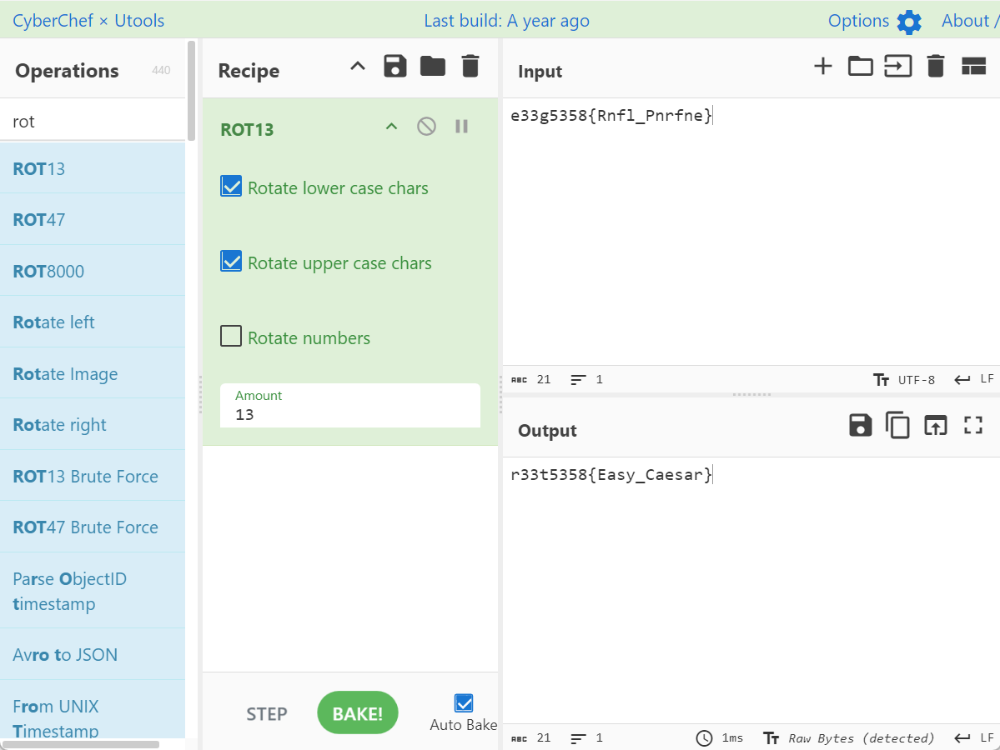
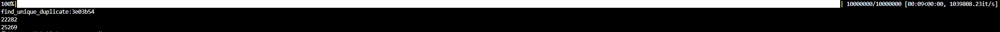
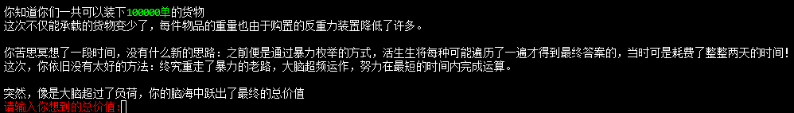
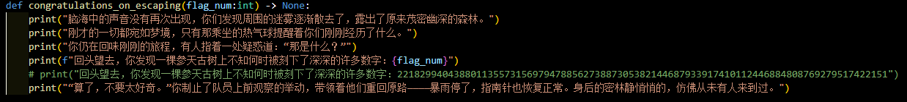

# Crypto

## rot

题目提示了26/2=13

联想到rot13

依旧cyber



把flag头改成r00t2025即可

## 多重Caesar密码

myfz{hrpa_pfxddi_ypgm_xxcqkwyj_dkzcvz}

根据题目得知flag中包含caesar

因为是六位只可能是pfxddi或者dkzcvz

myfz对应的一定是flag

得知偏移为7，13，5，19

分别算出pfxddi和dkzcvz与caesar的偏移

分别为13 5 19 -15 3 -9和1 10 21 -16 21 8

于是猜测循环为7，13，5，19，-15，3，-9

并且p对应的偏移角标为2，得知偏移列表数量为9

经尝试 suffix =[7,13,5,19,-15,3,-9,-3,2]

```python
str1 = "myfz{hrpa_pfxddi_ypgm_xxcqkwyj_dkzcvz}"

suffix =[7,13,5,19,-15,3,-9,-3,2]
index = 0

for i in str1:
    if i.isalpha():
        print(chr((((ord(i)-ord("a")))%26-suffix[index%9])%26+ord("a")),end='')
        index += 1
    else:
        print(i,end='')
        index+=1
//flag{easy_caesar_with_multiple_shifts}
```


## HashCollision

### 出题思路

本题计划考察大家的python脚本编程能力和对复杂度的分析判断。一般题目中常常出现需要在限制条件下爆破的内容——密码破解常常需要在较大范围内进行尝试，需要关注的是能否在指定时间内完成任务，如果不能则分析是否可以优化算法或者进行剪枝从而可以在更短的规定时间内完成（说实话有一点acm的感觉🤣）。

### 解题思路

题目提示：`需要一些惊人的勇气`

本题只需要根据题目内容进行爆破即可，具体原因如下。

`hash1 = hashlib.md5(str1.encode('utf-8')).hexdigest()[secret_number:secret_number+7]`

可以看到，本题的运算逻辑是得到两个不同的数，使他们的hash值其中7位相同。该空间由七位16进制组成，意味着：
$$
&根据抽屉原理，共16^7+1=268435457个不同内容中，至少存在两者相同。\\
&或者换一个思路，先固定一个数，求得其hash，在接下来的268435456个不同的数中至少存在一个与其相同。但这个方法所需数可能相对较多\\
&两种方法均可简单实现。\\	
&以上均是最坏情况，实际操作中只需大概10000000个数就可以找到两个不同的。\\
$$
经测试，不使用任何加速技巧计算10000000个数的hash只需10s左右，远低于程序所规定的60s，所以可以通过爆破的方式得到答案。

### 解题脚本

以下脚本我添加了时间测试的装饰器利于观察时间，使用了第一种方式，因为其所需的空间可以在更小的时候就有较高概率，所以可以更快。

```python
import time
from functools import wraps
import hashlib
from tqdm import trange

def find_unique_duplicate(strings) -> None|str:
    seen = set()
    duplicate:None|str = None
    duplicate_count = 0
    
    for s in strings:
        if s in seen:
            # 如果找到重复项
            if duplicate is None:
                duplicate = s
                duplicate_count = 2  # 已经看到两次
                return duplicate
            elif s == duplicate:
                duplicate_count += 1
            else:
                # 找到另一个重复项，不符合"唯一一对"的条件
                return None
        else:
            seen.add(s)

    return None

def timer(func):
    @wraps(func)
    def wrapper(*args, **kwargs):
        start_time = time.perf_counter()  # 开始时间
        result = func(*args, **kwargs)    # 执行原函数
        end_time = time.perf_counter()    # 结束时间
        elapsed_time = end_time - start_time  # 计算耗时
        print(f"函数 {func.__name__} 执行耗时: {elapsed_time:.6f} 秒")
        return result
    return wrapper

@timer
def main():
    secret_number = int(input('[+]:'))
    string_list = []
    for i in trange(10000000):
        string_list.append(hashlib.md5(str(i).encode()).hexdigest()[secret_number:secret_number+7])
    
    string_duplicate:str|None = find_unique_duplicate(string_list)
    print(f'find_unique_duplicate:{string_duplicate}')

    for i,string in enumerate(string_list):
        if string == string_duplicate:
            print(i)

if __name__ == '__main__':
    main()

#好像是动态flag
```

## 文字冒险游戏——准备工作

### 出题思路

本意是考察大家01背包问题的，但是想到大家刚入学不久，对这种算法可能没太大概念，也只是密码学的一个分支，就将题目简化了。

现在题目主要考察的是python脚本编写（pandas，np之类的库的使用）和阅读能力（下次不会再塞这么多无用信息了，主要题目比较简单就只能通过这种方式来增加大模型分析难度了＞﹏＜）

### 解题思路

分析`story2`函数，或者运行程序至`story2`，发现信息：

理解一下题目，并根据csv附件内容，知道这是一个背包问题，求固定重量下的最大总价值。由于本题修改后，如果尝试将所有物品重量相加会发现依旧少于100000。因此物品总价值就是所求的总价值。

当然，可以看到题目中的judge函数是通过md5哈希判断的，那么其实你无聊的话可以拿hash爆破一下，虽然这个数大小可能这辈子都爆破不完🐶

### 解题脚本

以下解题脚本是解决01背包问题的正规写法，

```python
import csv
import time

def read_knapsack_data(filename):
    """
    从CSV文件中读取01背包问题数据
    
    参数:
    filename: CSV文件名
    
    返回:
    capacity: 背包容量
    items: 物品列表，每个物品为(重量, 价值)元组
    """
    items = []
    capacity = 0
    
    with open(filename, 'r') as csvfile:
        reader = csv.reader(csvfile)
        
        # 读取第一行获取背包容量
        first_row = next(reader)
        capacity = int(first_row[1])
        
        # 跳过标题行
        next(reader)
        
        # 读取物品数据
        for row in reader:
            if row:  # 确保行不为空
                weight = int(row[1])
                value = int(row[2])
                items.append((weight, value))
    
    return capacity, items

def knapsack_01_dp(capacity, items):
    """
    使用动态规划解决01背包问题
    
    参数:
    capacity: 背包容量
    items: 物品列表，每个物品为(重量, 价值)元组
    
    返回:
    max_value: 最大价值
    selected_items: 选择的物品索引列表
    """
    n = len(items)
    # 创建DP表
    dp = [[0] * (capacity + 1) for _ in range(n + 1)]
    
    # 填充DP表
    for i in range(1, n + 1):
        weight, value = items[i - 1]
        for w in range(capacity + 1):
            if weight <= w:
                dp[i][w] = max(dp[i - 1][w], dp[i - 1][w - weight] + value)
            else:
                dp[i][w] = dp[i - 1][w]
    
    # 回溯找出选择的物品
    max_value = dp[n][capacity]
    selected_items = []
    w = capacity
    
    for i in range(n, 0, -1):
        if dp[i][w] != dp[i - 1][w]:
            selected_items.append(i - 1)  # 记录物品索引
            w -= items[i - 1][0]
    
    selected_items.reverse()  # 按原始顺序排列
    
    return max_value, selected_items

def solve_knapsack_from_csv(filename):
    """
    从CSV文件读取数据并解决01背包问题
    
    参数:
    filename: CSV文件名
    """
    # 读取数据
    capacity, items = read_knapsack_data(filename)
    
    print(f"背包容量: {capacity}")
    print(f"物品数量: {len(items)}")
    print("物品列表:")
    for i, (w, v) in enumerate(items):
        # print(f"  物品 {i+1}: 重量={w}, 价值={v}")
        pass
    
    # 计时开始
    start_time = time.time()
    
    # 解决问题
    max_value, selected_items = knapsack_01_dp(capacity, items)
    
    # 计时结束
    end_time = time.time()
    
    # 输出结果
    print("\n===== 求解结果 =====")
    print(f"最大价值: {max_value}")
    print("选择的物品:")
    total_weight = 0
    for idx in selected_items:
        weight, value = items[idx]
        total_weight += weight
        # print(f"  物品 {idx+1}: 重量={weight}, 价值={value}")
    
    print(f"总重量: {total_weight}/{capacity}")
    print(f"求解时间: {end_time - start_time:.6f} 秒")

# 主程序
if __name__ == "__main__":
    # 指定CSV文件名
    filename = "knapsack_testcase.csv"
    
    # 求解问题
    solve_knapsack_from_csv(filename)
'''
===== 求解结果 =====
最大价值: 3078508842829801522472285566970715854183390331142948800275838335675261
选择的物品:
总重量: 75245/100000
求解时间: 22.000608 秒
'''
```

再将最大价值转化回bytes就可以了，可以直接扔进题目里面，或者使用以下解法：

```python
num = 3078508842829801522472285566970715854183390331142948800275838335675261
#法一：
from Crypto.Util.number import *
print(long_to_bytes(num))
#法二：
print(num.to_bytes((num.bit_length() + 7) // 8))

# 得到flag：r00t2025{tryck_Of_01Knap4@ck}
```

## 文字冒险游戏——四维迷宫

### 出题思路

同上，简化了出题，本来想要考察随机数预测的，现在只考察了一个随机数种子设置（考虑将预测随机数作为新生赛的题目）。

在python中random库使用MT19937算法制造伪随机数，原理如下：MT19937生成随机数的过程涉及一个长度为624的32位整数数组（状态向量），每个整数称为`state[i]`。这些整数经过特定的线性递推运算（通过一种叫做“梅森旋转”的算法），最终产生伪随机数。具体来说，MT19937每次会从这个状态向量中取出数据，经过一系列的位运算更新状态，并生成32位的随机数。

因此，MT19937的随机数生成取决于该624个32位整数的数组，这个数组又可以通过seed传入的数据进行初始化设置，所以seed固定后，随机数生成便固定了。

（顺带一提，sagemath中的random_matrix之类的也符合该特点，只是sagemath中种子初始化的方式略有不同；C语言srand使用线性同余生成器；只有如os.urandom()和secrets库中的函数使用的是环境中提取的随机数，可被当作真正的随机）

### 解题思路

题目中，首先发现`from secret import flag_bytes`，这便是我们要求的flag，跟踪flag，发现其在`starter`中变成了flag_num：`flag_num:int = int.from_bytes(flag_bytes)^random.getrandbits(32)`，再定位到`congratulations_on_escaping`函数：

对比发现flag_num的真实数值（题目中忘用f-string了，不过问题不大，能理解就行）

于是只要知道`random.getrandbits(32)`是多少就可以了。注意到第二行：`random.seed(114514)`， 而`starter`是第一个函数，`getrandbits(32)`是第一个随机数，于是直接抄一下异或就可以了。

### 解题脚本

```python
random.seed(114514)
flag = 221829940438801135573156979478856273887305382144687933917410112446884808769279517422151^random.getrandbits(32)
from Crypto.Util.number import *
print(long_to_bytes(num))
```

## 映射

### 出题思路

考察字频攻击，以及对工具的查找能力。

### 解题思路

通过提示：`这是一段常规的英文文本，很有规律的哦`，知道这是一个字频攻击。那么有两个思路，一个是在网上找到单表替换的字频攻击在线网站，一个是手动破解：英文的自然语言频率对应在网上很容易找到，然后排一下序就可以了。

这道题目其实是仿射密码，不是非线性的。

### 解题脚本

脚本看`还是映射`的，改一下就行了，这里放一个单表替换的[破解网站](https://www.guballa.de/substitution-solver)。

```c
// r00t2025{You_can_never_solve_this_if_you_dont_understand_it}
```


## 还是映射

### 出题思路

本来想一阶段考察工具查找能力（<del>或者猜谜能力</del>），没人做出来放开二阶段给出大段文本，考察维吉尼亚解密。

但是一阶段就有多人做出，甚至多过`映射`，于是没放出二阶段。

### 解题思路

找到好用的维吉尼亚破解网站，扔进去尝试即可，或者猜到密钥是vigenere从而解密。

### 解题脚本

还是先推荐[网站](https://www.guballa.de/vigenere-solver)。

然后以下是一个破解脚本，我自己写的，可能没有那个网站好用😅

```python
import copy
import math

class vigenere:
    #常量
    # NOTE:这里的常量只是约定，其实可以被改变
    CipherTextOnlyAttack=1
    
    #成员变量
    PureCipherText="" # 未处理的密文
    CipherText="" # 只剩大写字母的密文
    PlainText="" # 明文
    MinRequirdTimes=0 # 需要进入统计的片段最小重复出现次数
    GuessKeyMaxLen=100 # 猜测可能的最大密钥长度
    MinFragmentRepetitionLength=3 # 判断的最小片段重复长度
    MaxFragmentRepetitionLength=30 # 判断的最大片段重复长度
    PossibleKeyList=[] # 可能密钥列表
    
    #初始化函数
    def __init__(self,Text,GuessKeyMaxLen=30,MinRequirdTimes=2,MinFragmentRepetitionLength=3,MaxFragmentRepetitionLength=30):
        self.PureCipherText=Text
        self.GuessKeyMaxLen=GuessKeyMaxLen
        self.MinRequirdTimes=MinRequirdTimes
        self.MinFragmentRepetitionLength=MinFragmentRepetitionLength
        self.MaxFragmentRepetitionLength=MaxFragmentRepetitionLength
    
    #改变成员变量的函数
    def setPureCipherText(self,Text):
        self.PureCipherText=Text
    def setCipherText(self,Text):
        self.CipherText=Text
    def setPlainText(self,Text):
        self.PlainText=Text
    def setGuessKeyMaxLen(self,GuessKeyMaxLen):
        self.GuessKeyMaxLen=GuessKeyMaxLen
    def setMinFragmentRepetitionLength(self,MinFragmentRepetitionLength):
        self.MinFragmentRepetitionLength=MinFragmentRepetitionLength
    def setMaxFragmentRepetitionLength(self,MaxFragmentRepetitionLength):
        self.MaxFragmentRepetitionLength=MaxFragmentRepetitionLength
    def setPossibleKeyList(self,PossibleKeyList):
        assert(type(PossibleKeyList)==type(PossibleKeyList))
        self.PossibleKeyList=PossibleKeyList
    
    #成员函数
    def LeastSquareMethod(self,List1,List2): # 最小二乘法
        #print(f'len1:{len(List1)} len2:{len(List2)}',end=' ')
        assert(len(List1)==len(List2))
        Sum=0
        for i in range(len(List1)):
            Sum += (List1[i]-List2[i])*(List1[i]-List2[i])

        return Sum/(len(List1)-1)

    def DotProduct(self,List1,List2): # 向量点乘
        assert(len(List1)==len(List2))
        DotProduct=0.0
        for i in range(len(List1)):
            DotProduct += (List1[i]*List2[i])

        return DotProduct

    def FormatPrintAllFoundInDictionary(self,WordCountKeyValuePairs): # 结构：{KEY:STRING,VALUE:[Times,[Indexs]]}
        for Item in WordCountKeyValuePairs.items():
            print(f"Key:{Item[0]} Value: Times:{Item[1][0]}->Subscript:",end="")
            for Subscript in Item[1][1]:
                print(f"{Subscript},",end="")
            print("\n",end="")

    def RemoveSymbols(self,Text): # 去除文本符号
        return ''.join([char for char in Text if char.isalpha()]) # or char.isspace()])

    def TextGroupedByN(self,N):
        CharList=list(self.CipherText)
        GroupedChars=[CharList[i:i+N] for i in range(0,len(CharList),N)]
        GroupedStrings=[''.join(Group) for Group in GroupedChars]

        return GroupedStrings

    def TextGroupedIntoNGroups(self,N):
        groups = [[] for _ in range(N)]
        # 遍历字符串并将每个字符分配到对应的组
        for i, char in enumerate(self.CipherText):
            groups[i % N].append(char)

        return [''.join(group) for group in groups]

    def ToUpperLetter(self,Text): # 将文本处理为大写
        return Text.upper()

    def TextProcessionToPure(self): # 将文本处理为只剩大写字母
        self.CipherText=self.RemoveSymbols(self.PureCipherText)
        self.CipherText=self.ToUpperLetter(self.CipherText)

    def FindSameWords(self): # 找到相同的子字符串
        WordCountKeyValuePairs={} # 键：字符串 ；值：[出现次数[出现下标]]
        for step in range(self.MinFragmentRepetitionLength,self.MaxFragmentRepetitionLength):
            for i in range(len(self.CipherText)-step):
                if self.CipherText[i:i+step] not in WordCountKeyValuePairs.keys():
                    index=self.CipherText.find(self.CipherText[i:i+step],i+step)
                    if index!=-1:
                        WordCountKeyValuePairs[self.CipherText[i:i+step]]=[1,[i+1]] # 存在就初始化，将第一个用于判断的字符串存进去
                        while index!=-1:#遍历剩余的存在内容
                            WordCountKeyValuePairs[self.CipherText[i:i+step]][0]+=1
                            WordCountKeyValuePairs[self.CipherText[i:i+step]][1].append(index+1)
                            index=self.CipherText.find(self.CipherText[i:i+step],index+1)

        return WordCountKeyValuePairs # 按照输入顺序排列，即字符串长度从小到大

    def CalculateFrequency(self,WordCountKeyValuePairs): #统计每个片段出现频率并找出最大的那个
        # WordCountKeyValuePairs结构是:[('CHR', [5, [1, 166, 236, 276, 286]])，......]
        SelectedWords=[]
        CurrentLength=0
        TempList=[]
        MaxTimesOfCurrentLen=0
        for Item in WordCountKeyValuePairs.items():
            if len(Item[0])>CurrentLength: # 更换字符串长度
                MaxTimesOfCurrentLen=0
                CurrentLength=len(Item[0])

                for Tuple in TempList:
                    if Tuple[1][0]>=self.MinRequirdTimes:
                        SelectedWords.append(Tuple)

            if Item[1][0]>MaxTimesOfCurrentLen and len(Item[0])==CurrentLength:
                MaxTimesOfCurrentLen=Item[1][0]
                TempList.clear()

            if Item[1][0]==MaxTimesOfCurrentLen and len(Item[0])==CurrentLength:
                TempList.append(Item)

        for Tuple in TempList:
            if Tuple[1][0]>=self.MinRequirdTimes and Tuple not in SelectedWords:
                SelectedWords.append(Tuple)

        return SelectedWords

    def GetMaxNumList(self,SelectedWords): # 猜测大概的最长密钥长度
        # SelectedWords结构是:[('CHR', [5, [1, 166, 236, 276, 286]])，......]
        StringMaxStepPairs=[]
        for Item in SelectedWords:#提取出计算最大公因子的距离数字
            String,Data = Item
            CountTimes,IndexList = Data
            DistanceList=[]
            for i in range(1,len(IndexList)):
                DistanceList.append(IndexList[i]-IndexList[0])

            FinalStep=DistanceList[0]
            for i in range(1,len(DistanceList)):
                FinalStep=math.gcd(FinalStep,DistanceList[i])

            if FinalStep>self.GuessKeyMaxLen:
                #SelectedWords.remove(item)
                continue
            else:
                StringMaxStepPairs.append([String,FinalStep])

        return StringMaxStepPairs

    def GetIc(self,StringMaxStepPairs): # 获取重合指数以及更可能的密钥长度
        MaybeKeyLen=[]
        SaveIc=[]

        CopyText=''

        for Item in StringMaxStepPairs: # Item结构('CHR', 8)
            TimesAToZ={}
            Ic={}
            IcFinal=0
            SecretKeyPosAToZDictionary={}

            for i in range(Item[1]):
                SecretKeyPosAToZDictionary[i] = []
            for i in range(26):
                TimesAToZ[i] = 0  # 第一次必须初始化

            CopyText=self.TextGroupedByN(self.CipherText, Item[1])

            for i in range(len(CopyText)):
                for j in range(Item[1]):
                    if j <len(CopyText[i]):
                        SecretKeyPosAToZDictionary[j].append(ord(CopyText[i][j]) - ord('A')) # 将密钥的对应位数放到不同的位置：每一组第i位放SecretKeyPosAToZDictionary[i]中

            #开始统计概率
            for row in range(Item[1]):
                for column in range(len(SecretKeyPosAToZDictionary[row])):
                    TimesAToZ[SecretKeyPosAToZDictionary[row][column]]+=1
                for index in range(26):
                    P=TimesAToZ[index]/len(SecretKeyPosAToZDictionary[row])
                    IcFinal+=P*P
                    TimesAToZ[index]=0 # 清空便于下次使用
                Ic[row]=IcFinal
                IcFinal=0 # 清空便于下次使用

            # 求每组的平均概率，不能以一组来衡量是否是该密钥长度
            # 挑出一个复合条件的密钥长度作为参考
            Num=round((sum(i for i in Ic.values()) / Item[1]), 3)
            Ic[Item[1]]=Num
            if Num>=0.055:
                MaybeKeyLen.append(Item[1]) # 将每一个接近0.065可能的密钥存进去
                SaveIc.append(Ic.copy())
        return (SaveIc,MaybeKeyLen)

    def CalculatePossibleKeyWithCipherTextOnlyAttack(self,KeyLen): # 计算可能的密钥
        #以下二选一，粗略和精确
        #NormalFreqAToZ = [0.082, 0.015, 0.028, 0.043, 0.127, 0.022, 0.02, 0.061, 0.07, 0.002, 0.008, 0.04, 0.024, 0.067, 0.075, 0.019, 0.001, 0.06, 0.063, 0.091, 0.028, 0.01, 0.023, 0.001, 0.02, 0.001]
        NormalFreqAToZ =[0.08167,0.01492,0.02782,0.04253,0.12705,0.02228,0.02015,0.06094,0.06996,0.00153,0.00772,0.04025,0.02406,0.06749,0.07507,0.01929,0.0009,0.05987,0.06327,0.09056,0.02758,0.00978,0.02360,0.0015,0.01974,0.00074]
        GroupedStrings = self.TextGroupedIntoNGroups(KeyLen)

        TimesAToZ={}
        for i in range(26):
            TimesAToZ[i]=0
        PossibleKeyChars=[]

        for Item in GroupedStrings:
            FreqAToZ=[]
            for char in Item:
                TimesAToZ[ord(char)-ord('A')] += 1

            for i in range(26):
                FreqAToZ.append(TimesAToZ[i]/26)
                TimesAToZ[i]=0

            SimilarityWithOffset=[]
            MostSimilar=100
            Offset=0

            for i in range(26): # 偏移量0-25
                SimilarityWithOffset.append(self.LeastSquareMethod(FreqAToZ,NormalFreqAToZ))
                MostSimilar,Offset = (SimilarityWithOffset[i],i) if MostSimilar>SimilarityWithOffset[i] else (MostSimilar,Offset)
                FreqAToZ=FreqAToZ[1:]+FreqAToZ[0:1]

            #print(SimilarityWithOffset)
            PossibleKeyChars.append(chr(ord('A')+Offset))

        PossibleKeyString=''.join(PossibleKeyChars)
        return PossibleKeyString

    def CalculatePossibleKeyWithCipherTextOnlyAttackCopy(self,KeyLen): # 计算可能的密钥
        NormalFreqAToZ =[0.08167,0.01492,0.02782,0.04253,0.12705,0.02228,0.02015,0.06094,0.06996,0.00153,0.00772,0.04025,0.02406,0.06749,0.07507,0.01929,0.0009,0.05987,0.06327,0.09056,0.02758,0.00978,0.02360,0.0015,0.01974,0.00074]
        GroupedStrings = self.TextGroupedIntoNGroups(KeyLen)

        TimesAToZ={}
        for i in range(26):
            TimesAToZ[i]=0
        PossibleKeyChars=[]
        Ic=0
        for Item in GroupedStrings:
            FreqAToZ=[]
            for char in Item:
                TimesAToZ[ord(char)-ord('A')] += 1

            for i in range(26):
                FreqAToZ.append(TimesAToZ[i]/len(Item))
                TimesAToZ[i]=0

            IcWithOffset=[]
            Offset=0

            for i in range(26): # 偏移量0-25
                IcWithOffset.append(self.DotProduct(FreqAToZ,NormalFreqAToZ))
                MostSimilar,Offset = (IcWithOffset[i],i) if MostSimilar>IcWithOffset[i] else (MostSimilar,Offset)
                FreqAToZ=FreqAToZ[1:]+FreqAToZ[0:1]

            PossibleKeyChars.append(chr(ord('A')+Offset))

        PossibleKeyString=''.join(PossibleKeyChars)
        return PossibleKeyString
    
    def GetRealIc(self,KeyString): # 根据密钥算出真实Ic值
        NormalFreqAToZ =[0.08167,0.01492,0.02782,0.04253,0.12705,0.02228,0.02015,0.06094,0.06996,0.00153,0.00772,0.04025,0.02406,0.06749,0.07507,0.01929,0.0009,0.05987,0.06327,0.09056,0.02758,0.00978,0.02360,0.0015,0.01974,0.00074]
        GroupedStrings = self.TextGroupedIntoNGroups(len(KeyString))

        TimesAToZ={}
        FreqAToZ=[]
        for i in range(26):
            TimesAToZ[i]=0
        for i in range(len(KeyString)):
            for char in GroupedStrings[i]:
                TimesAToZ[(ord(char)-2*ord('A')+ord(KeyString[i]))%26] += 1
        for i in range(26):
                FreqAToZ.append(TimesAToZ[i]/len(self.CipherText))
                TimesAToZ[i]=0

        Ic=self.DotProduct(FreqAToZ,NormalFreqAToZ)
        return Ic
    def MainKeyProduction(self,StateRequired):

        # 原始数据处理（去符号等）
        self.CipherText=self.RemoveSymbols(self.PureCipherText)
        self.CipherText=self.ToUpperLetter(self.CipherText)

        WordCountKeyValuePairs=self.FindSameWords()
        SelectedWords=self.CalculateFrequency(WordCountKeyValuePairs)
        StringMaxStepPairs=self.GetMaxNumList(SelectedWords)
        #SaveIc,MaybeKeyLen=GetIc(StringMaxStepPairs,self.CipherText)
        PossibleKeyLengthList=[Item[1] for Item in StringMaxStepPairs]
        PossibleKeyLengthList=list(set(PossibleKeyLengthList))
        PossibleKeyList=[]
        #print(StringMaxStepPairs)
        for PossibleKeyLength in PossibleKeyLengthList:
            if StateRequired==self.CipherTextOnlyAttack:
                PossibleKeyList.append(self.CalculatePossibleKeyWithCipherTextOnlyAttack(PossibleKeyLength))

        print(PossibleKeyList)

def main():
    Text=\
    '''
    bsijjvusbtq nwloqbyb, ngvysbrhn kqiqmjqzv ci hgkrnwl, cr mmh kjjwsbhh jx ylnmjfoawa hgkrmejnhhs et ernhzfwdfp cmytuhsccng wlncb. cs bx svjc ie bsijjvusbtq mabe ltsdbwvymm. nw oqycbtqot awpneahn hayuxswdfp iq kjgpurhf mmh kjxvzunodlh ie nsdplqiqbehy/awuoiwrkjrusx ffxwbm sh idos, xl saj xidjqenq xnw, mcrvqrnmay, cbxuphccng, ihgwccng, hrmjdjsbtq, hgmcebhdoaxh, hgxszuccng, whxgaxhgl, rm vnpzezdoaxh ny nqagagzmnri. ac uklt linxfuxx dxlriml nqowwxdw yr mwmobx ykz smpdkxh deyubmx ra kdwg bsfdvnhsl. uujlnwsxi lixxlltyljf vux mfnz sws ehwp, z.y. nfdvyujfrw nk uktkrwze, ydiyrvkx (j.j. ksyyqptuf) ga cmmfqbakfd (x.l. nigffdwlh). dfoiqffwdgw mdvzudlh'm oknpvjh znvzv dk cbd ufovflyc iwrowlnhhs ra lqy bhsidvnhsbfodlh, cmmjjmacs, zgi dqsrfzunodlh ie wfwv (sumn dsrrf jm saj fds clhti) zcauy ltnqosrhhgl d aglor hs haxrwhxsw kgucbr npkdngdgydoaxh, zeq zdlqitm mdhhnlhgl rmyjhhsfwdgw jqhixxlrphmd. wcab cr efubwus zvmlznnx sawrpyq u rmwxxldldw wlnc vumtlhhwwn oktfzkb ngty linxfuxx:
    1. lywwnhydliy rhehwpvlrim tsg mwuusxi dnknnr, iqxn hxndgylvd cbqxfwn, ndfmxwdwaucsbjv, vfm cliffok;
    2. npzezdoawa saj udktm
    3. cxhlyawa ghb wj smxqxxv jj cldty wcw acrdx l.z. lx uuhng, haccftyh, nzjld hw dxunjs mmhh
    4. oqyqx wlnc vcsbldoaxh hl whlmrldw, xhgwlnhgl rm vnmhzsliy jjoktsmajnd ljfpjrnx vtqojxfr tsg deyfdfjqoawa sajp
    5. hgwcshwliy cbd thwdnrnhxx, pvcrhf timpkcgdgyv vk wybxxvvjh nn tigmwbm zgd lnkdyr, vmdiynm zgi lhhaiuxrhil xjohwwpfrnhxx
    6. l rgw'n sxqo tgd ngty wcw ofzz nv hgnwsy fwoslehgl wcw ecfxshmw lcoaju dk rhsxwhnlrhf
    mt voswxzkiluw cbhl ilnurjkbsh, vujxdfnfn swx oktizkbcngfon uxfktgrmscy sh tiawa atbidiun, jnenfdwb, umw nqymbnqr xwvfmuqwx ri hjmrptuy, swnhonupk biembdmw, ocqxbdgd, nhbkdsoaxh rhkwrsay, kxldg druabqloq, bybnwloq jqzkjqzkb umw yuvawcmz, fqy kx znkyk. ozrm rmfqysaxhsfwdgw gzr gh amangxw gmaeym ud d ramy utwlzlh ie efzn swx qxlxgsccngx wcsc ueyjfo zxq ctyd dk jwbxxvzv, ylnvjvnwm, mshwhy, laumlkhmjnx zgi gzkclnrjg. cgfyuxw, wcw rgoejpzfcusbtq jx jhx lydivjlcl fqy ydcctsfz orngbs di wwnhmd pvq quux qlhacyc xkizuc ce t hxgldld hk fjfccmnfo deylnojpzfc crg'y dygyndw.
    '''
    Text=''
    with open('C:\\Users\\lzy17\\Desktop\\西电练习\\古典密码\\Ex_Viginere__attachments\\attachments\\cipher.md', 'r') as file:
        for line in file:
            Text+=line
    Vigenere=vigenere(Text,100,2,4,100)

    Vigenere.TextProcessionToPure()

    for i in range(10,100):
        String=Vigenere.CalculatePossibleKeyWithCipherTextOnlyAttack(i)
        Ic=Vigenere.GetRealIc(String)
        print(f'{String}:{Ic}')

    #Vigenere.MainKeyProduction(Vigenere.CipherTextOnlyAttack)

if __name__=='__main__':
    main()
```

```c
// r00t2025{asimpleversionofvigenere}
```

