# Misc

## base64

根据题目提示知道是base64编码

```txt
cjAwdDIwMjV7eW91X2tub3dfYmFzZTY0fQ==
```

用cyber解密

```txt
r00t2025{you_know_base64}
```

## Multilayer_base64

题目提示是多重base64

### **法一** cyber

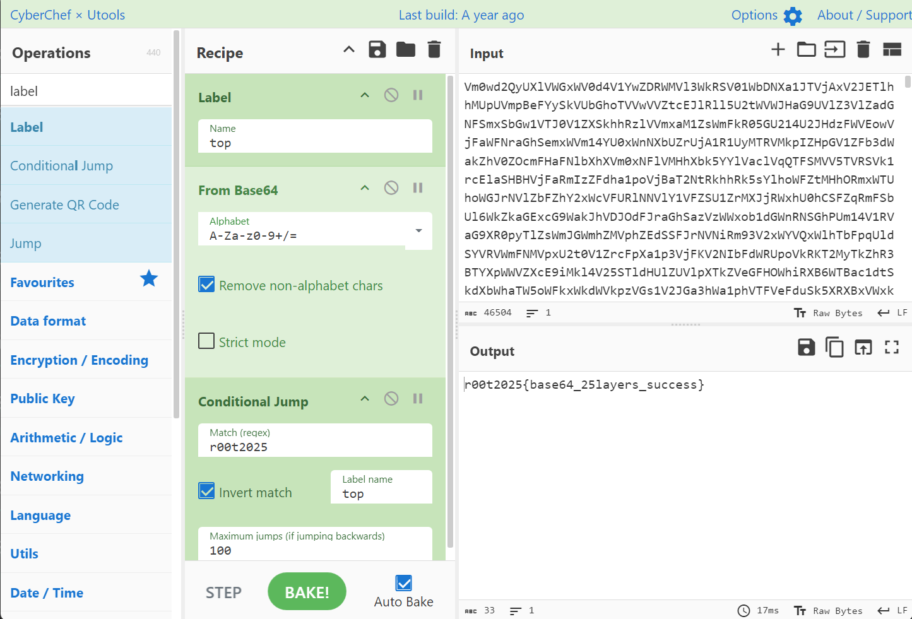

最多100次base64，遇到r00t2025就停止

### 法二 python脚本

```python
import base64
with open('Multilayer_base64.txt','r') as f:
    data = f.read()
while True:
    data = base64.b64decode(data).decode()
    if data.startswith('r00t2025{'):
        print(data)
        break
//r00t2025{base64_25layers_success}
```

## 打不开的base64

由于windows自带的记事本默认会将整个文件**一次性读进内存**，在读大文件时可能导致内存溢出、程序无响应。

直接写python脚本来读取。

```python
import base64
with open('base64_python.txt','r') as f:
    data = f.read()
while True:
    data = base64.b64decode(data).decode()
    if data.startswith('r00t2025{'):
        print(data)
        break
//r00t2025{You_are_already_getting_started_with_python}
```

## spaces

打开后发现什么都没有，但是左下角显示有108个字符，base64编码一下

```txt
4oCD4oCC4oCD4oCD4oCJ4oCD4oCD4oCD4oCD4oCD4oCJ4oCC4oCC4oCD4oCJ4oCC4oCC4oCD4oCD4oCC4oCD4oCJ4oCC4oCD4oCJ4oCC4oCD4oCC4oCJ4oCC4oCJ4oCC4oCC4oCD4oCD4oCC4oCD4oCJ4oCD4oCD4oCJ4oCC4oCD4oCJ4oCC4oCC4oCC4oCD4oCD4oCJ4oCD4oCJ4oCC4oCJ4oCC4oCD4oCC4oCJ4oCC4oCC4oCD4oCD4oCC4oCD4oCJ4oCD4oCD4oCD4oCD4oCD4oCJ4oCC4oCC4oCD4oCC4oCJ4oCC4oCC4oCD4oCD4oCC4oCD4oCJ4oCD4oCD4oCJ4oCD4oCD4oCD4oCD4oCD4oCJ4oCC4oCD4oCC4oCJ4oCC4oCC4oCC4oCJ4oCC4oCJ4oCD4oCC4oCD4oCC4oCD4oCD
```

发现总共有**三种符号**

1. 4oCD
2. 4oCC
3. 4oCJ

联想到摩斯密码（.点/_下划线/ 空格）

替换，解密

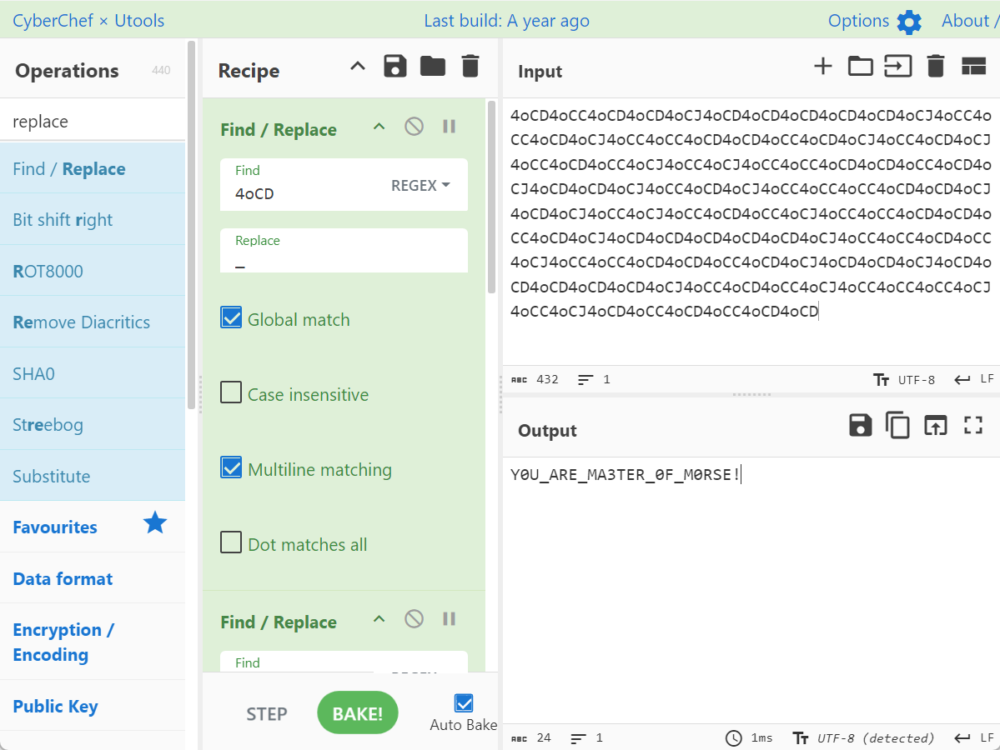

## 奶龙的压缩包

在压缩包的注释中给出了密码的一部分

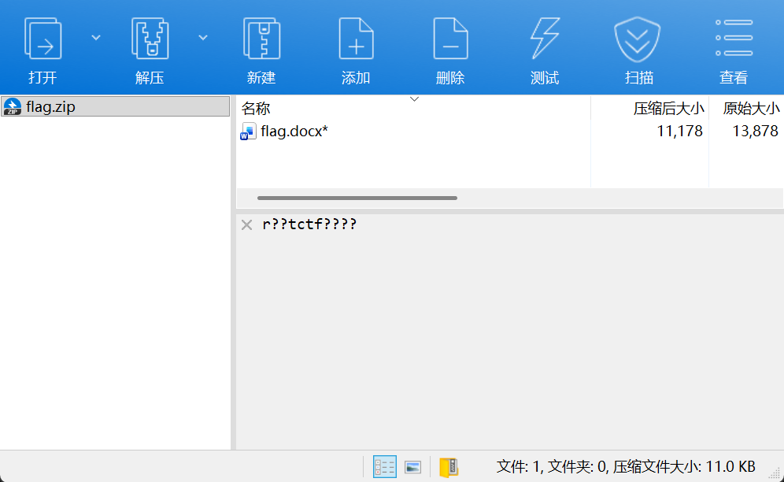

进行掩码爆破，我这里用的工具是**passware**

拖入压缩包->删除所有默认攻击->新建爆破攻击->高级设置->将模式设为r??tctf??(这里?代表一位未知的字符)->长度设为11->勾选数字

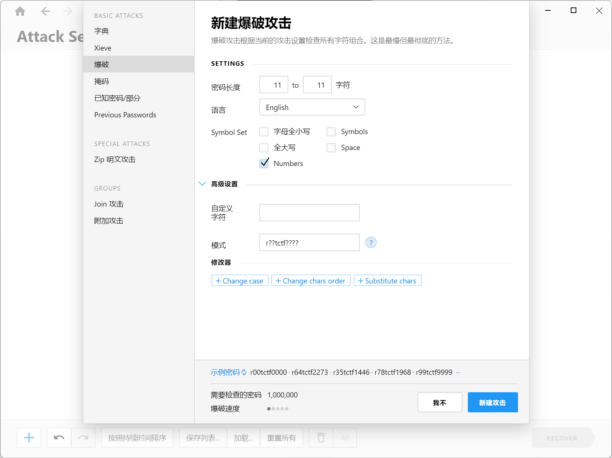

点击recover

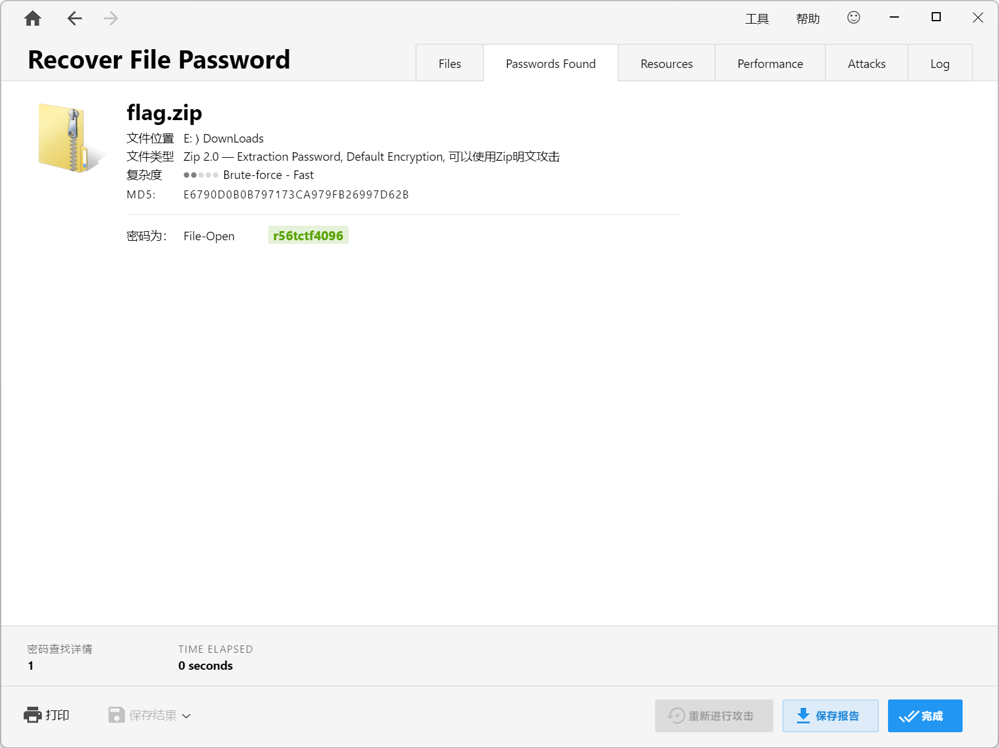

得到密码r56tctf4096

拿到一个docx，打开发现里面什么都没有

点击设置->选项->显示->勾选隐藏文字

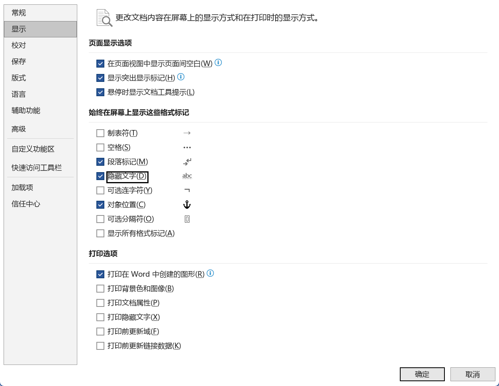

alt+a全选发现有东西了

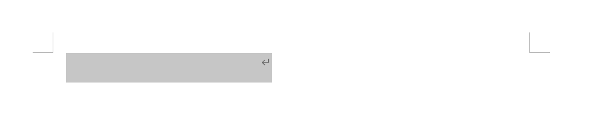

换个颜色

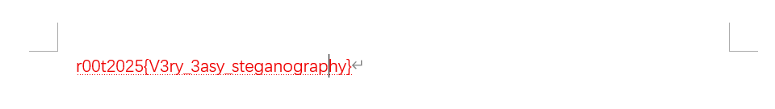

## 奶龙的压缩包2

题目说没设置密码，但发现压缩包要输入密码，联想到伪加密，用010打开

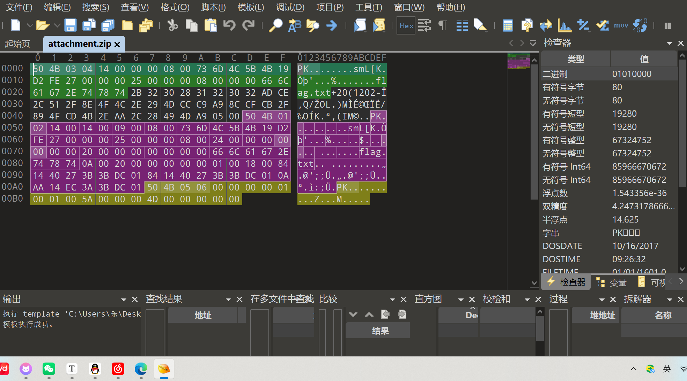

#### 压缩包文件结构

`50 4B 03 04`是Zip文件的文件头，标明这是一个Zip文件

`50 4B 05 06`是Zip文件的结尾标志

`50 4B 01 02`是目录中文件文件头标记

#### 本地文件头

本地文件头具有由多字节值组成的特定字段结构。所有值都以 little-endian 字节顺序存储，其中字段长度以字节为单位计算长度。 ZIP 文件中的所有结构对每个文件条目都使用 4 字节签名。中央目录签名的结尾是 0x06054b50，可以使用自己的唯一签名进行区分。以下是存储在本地文件头中的信息的顺序。

| 偏移量 | 字节 | 描述                                                       |
| :----- | :--- | :--------------------------------------------------------- |
| 0      | 4    | 本地文件头签名#0x04034b50（读作小端数）                    |
| 4      | 2    | 提取所需的版本（最低）                                     |
| 6      | 2    | 通用位标志（是否加密，用010改成09 00打开就会显示有密码了） |
| 8      | 2    | 压缩方式                                                   |
| 10     | 2    | 文件最后修改时间                                           |
| 12     | 2    | 文件最后修改日期                                           |
| 14     | 4    | CRC-32                                                     |
| 18     | 4    | 压缩后的大小                                               |
| 22     | 4    | 未压缩大小                                                 |
| 26     | 2    | 文件名长度 (n)                                             |
| 28     | 2    | 额外字段长度 (m)                                           |
| 30     | n    | 文件名                                                     |
| 30+n   | m    | 额外字段                                                   |

#### 中央目录文件头 

| 偏移量 | 字节 | 描述                                                         |
| :----- | :--- | :----------------------------------------------------------- |
| 0      | 4    | 中央目录文件头签名#0x02014b50                                |
| 4      | 2    | 版本由                                                       |
| 6      | 2    | 提取所需的版本（最低）                                       |
| 8      | 2    | 通用位标志（是否加密）                                       |
| 10     | 2    | 压缩方式                                                     |
| 12     | 2    | 文件最后修改时间                                             |
| 14     | 2    | 文件最后修改日期                                             |
| 16     | 4    | CRC-32                                                       |
| 20     | 4    | 压缩后的大小                                                 |
| 24     | 4    | 未压缩大小                                                   |
| 28     | 2    | 文件名长度 (n)                                               |
| 30     | 2    | 额外字段长度 (m)                                             |
| 32     | 2    | 文件注释长度 (k)                                             |
| 34     | 2    | 文件开始的磁盘号                                             |
| 36     | 2    | 内部文件属性                                                 |
| 38     | 4    | 外部文件属性                                                 |
| 42     | 4    | 本地文件头的相对偏移量。这是文件所在的第一个磁盘的开头与本地文件头的开头之间的字节数。这允许软件读取中央目录来定位 ZIP 文件中文件的位置。 |
| 46     | n    | 文件名                                                       |
| 46+n   | m    | 额外字段                                                     |
| 46+n+m | k    | 文件注释                                                     |

#### 中央目录记录结束 

| 偏移量 | 字节 | 描述                                   |
| :----- | :--- | :------------------------------------- |
| 0      | 4    | 中央目录签名结束#0x06054b50            |
| 4      | 2    | 此磁盘的编号                           |
| 6      | 2    | 中央目录开始的磁盘                     |
| 8      | 2    | 此磁盘上的中心目录记录数               |
| 10     | 2    | 中央目录记录总数                       |
| 12     | 4    | 中央目录的大小（字节）                 |
| 16     | 4    | 中央目录开始的偏移量，相对于存档的开始 |
| 20     | 2    | 评论长度 (n)                           |
| 22     | n    | 评论                                   |

这里压缩源文件数据区的全局标志位是偶数50 4B 03 04 14 00 00中最后的00(未加密)

但是压缩源文件目录区的全局标志位是奇数50 4B 01 02 14 00 14 00 09 最后的09(加密)

显然是伪加密

将09改成00，保存后发现没密码了

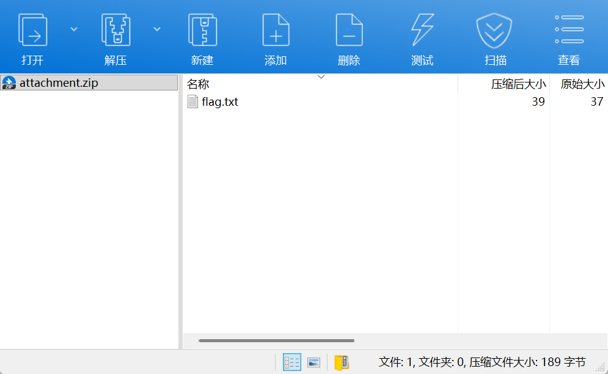


得到flag

```txt
r00t2025{it's_actually_not_encrypted}
```

## 奶龙的头

考察了lsb隐写，一般是从左上角开始的，所以题目说奶龙头顶的颜色怪怪的😂

#### 最低有效位（LSB）

LSB即为最低有效位（Least Significant Bit，lsb），我们知道，图片中的图像像素一般是由RGB三原色（红绿蓝）组成，每一种颜色占用8位，取值范围为0x00~0xFF，即有256种颜色，一共包含了256的3次方的颜色，即16777216种颜色。而人类的眼睛可以区分约1000万种不同的颜色，这就意味着人类的眼睛无法区分余下的颜色大约有6777216种。

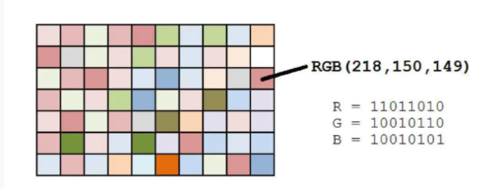

LSB隐写就是修改RGB颜色分量的最低二进制位也就是最低有效位（LSB），而人类的眼睛不会注意到这前后的变化，每个像数可以携带3比特的信息。

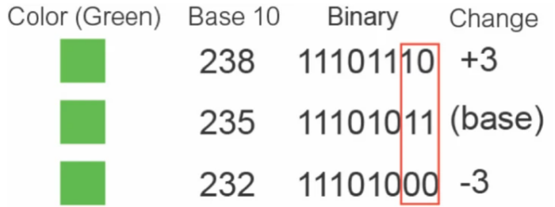

工具stegsolve，选择Data Extract

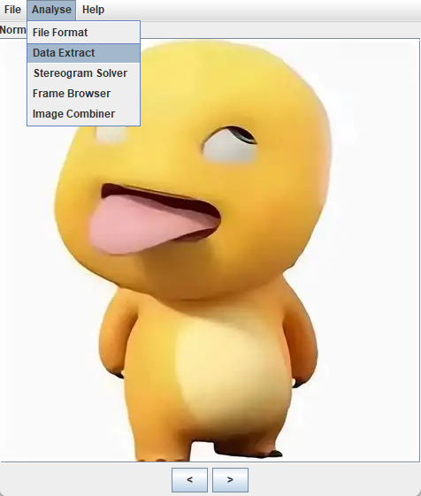

查看RGB的最低位

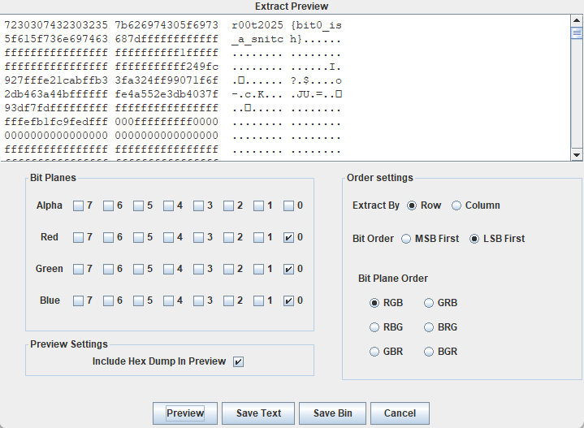

## 我是奶龙

#### 图片宽高隐写

对于图片，通过**010Editor**打开可以直接修改宽高，但如果要恢复原始比例就需要用到CRC校验码了，涉及到CRC撞库，需要写脚本来实现，并且当源文件过大，则难以枚举

| 内容                    | 含义                                                         |
| ----------------------- | ------------------------------------------------------------ |
| 89 50 4E 47 0D 0A 1A 0A | png的文件头（固定）                                          |
| 00 00 00 0D             | 十进制为13，代表头部数据块的长度为13                         |
| 49 48 44 52             | ASCII码为IHDR，表明数据块为IHDR                              |
| 00 00 02 58             | 图片宽度（4bit）（不固定）                                   |
| 00 00 02 58             | 图片高度（4bit）（不固定）                                   |
| 08 06 00 00 00          | 依次为Bit depth、ColorType、 Compression method、 Filter method、Interlace method（共5bit）（不固定） |
| BE 66 98 DC             | CRC校验码（4bit）                                            |

还是用010打开

**法一** 手动修改

先查看图片的分辨率474*448

转为十六进制1da和1c0

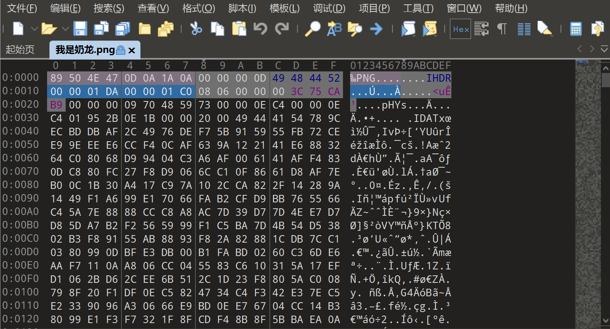

将高改大，保存

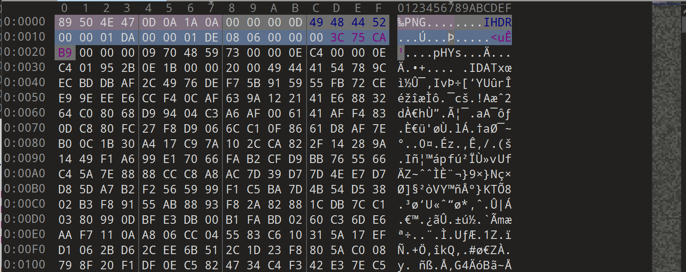


**法二** python脚本爆破

```python
import zlib
import struct
import argparse
import itertools

parser = argparse.ArgumentParser()
parser.add_argument("-f", type=str, default=None, required=True)
args  = parser.parse_args()

bin_data = open(args.f, 'rb').read()
crc32key = zlib.crc32(bin_data[12:29]) # 计算crc
original_crc32 = int(bin_data[29:33].hex(), 16) # 原始crc

if crc32key == original_crc32: # 计算crc对比原始crc
    print('宽高没有问题')
else:
    input_ = input("宽高错误, 是否CRC爆破宽高? (Y/n):")
    if input_ not in ["Y", "y", ""]:
       exit()
    else: 
        for i, j in itertools.product(range(4095), range(4095)):
            data = bin_data[12:16] + struct.pack('>i', i) + struct.pack('>i', j) + bin_data[24:29]
            crc32 = zlib.crc32(data)
            if(crc32 == original_crc32): 
                print(f"\nCRC32: {hex(original_crc32)}")
                print(f"宽度: {i}, hex: {hex(i)}")
                print(f"高度: {j}, hex: {hex(j)}")
                exit(0)
```

## 真·跳舞的小人

考察gif拆分+跳舞的小人

**先拆分gif**

linux下分帧

```bash
convert output_larger.gif  output_larger.png
```

搜索一下跳舞的小人

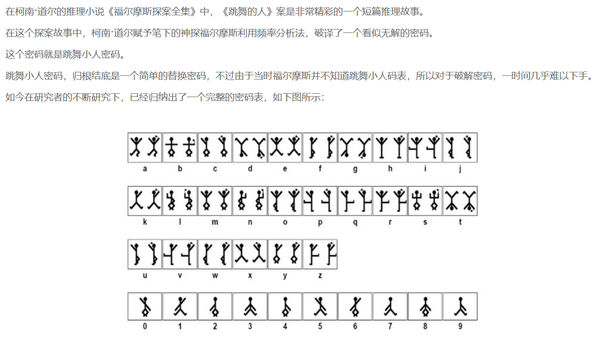

```txt
r00t2025{TheDancingMen}
```

## 简单的流量

发现在HTTP流中访问了secret.txt，返回的base64很可疑

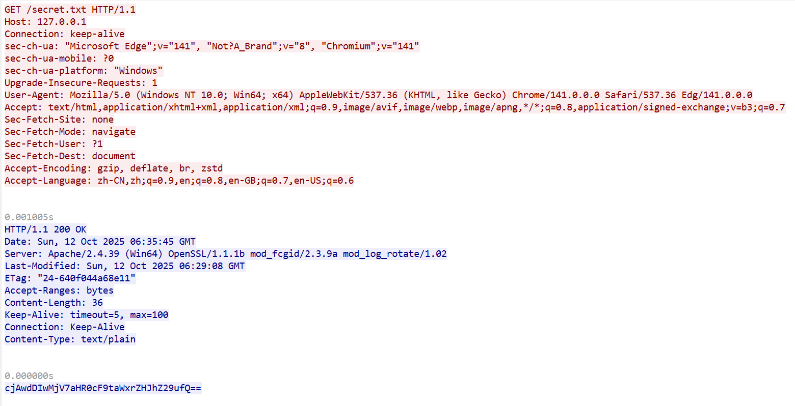

解码一下

```txt
r00t2025{http_milkdragon}
```

## 生日快乐

附件是一封邮件，里面有一个压缩包，压缩包是有密码的

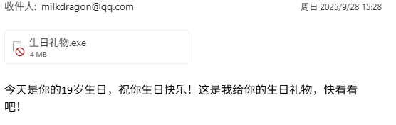

根据19岁生日和发件日期不难得到此人的生日是20060928，猜测这就是密码，果真如此！

解压之后发现有一个exe，题目说了要找到这个木马文件连接到的地址，你可以直接运行，然后看一下本机的网络情况就可以看到回连地址，当然如果是真的木马肯定不能这样做，我们可以利用在线的沙箱

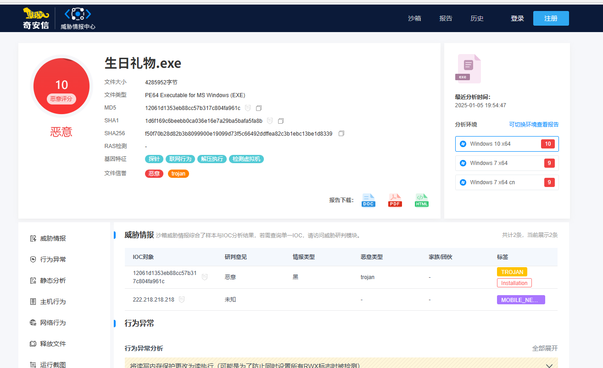

这里我们用奇安信的沙箱https://sandbox.ti.qianxin.com/sandbox/

## 老游一整再整

这道题其实是去年新生赛的题目，因为比较好玩，所以放到预热赛给大家玩了，详细的解法可以查看：https://github.com/r00t-security-lab/rtctf2024_h2/blob/master/misc/w1/%E8%80%81%E6%B8%B8%E6%96%B0%E6%95%B4/wp.md

## 你知道八卦图吗？

### 出题思路

考察gif拆分，以及二维码的识别标准

### 解题思路

如图：

这是一张旋转的八卦图，其中有一帧可以看到一个二维码一样的东西。

于是我们先将gif拆开：这里我们有很多种方法，比如使用在线工具，写python脚本等等。这里我们使用`ffmpeg`，这个工具是格式工厂等大型工具的一个重要内核，可以方便的转换非常多的格式，重要的是开源免费。`ffmpeg -i input.gif -vsync vfr -q:v 0 %d.png`

其中看见一张图片是这样的：

但是我们虽然已经看见二维码了，仍然无法扫描它，为什么呢？

因为二维码主要依靠三个定位码来确定其所在平面，就是三个，而这张二维码的左上角二维码被遮住了部分。

于是，我们的任务就是将该二维码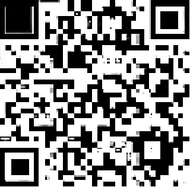的定位码恢复。

简单手动修复一下就好了（我就把右边的定位码复制了一份放到左边）：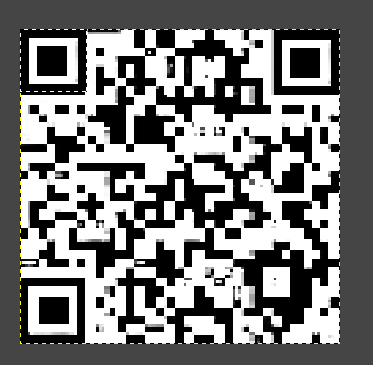

扫码得到flag：`r00t2025{U_f@nd_M1_in_the_GIF!!!}`
