# rev

## ez_string

### 出题思路

学习使用ida的第一步，查找字符串

### 解题思路

`shift+F12`：查找字符串。

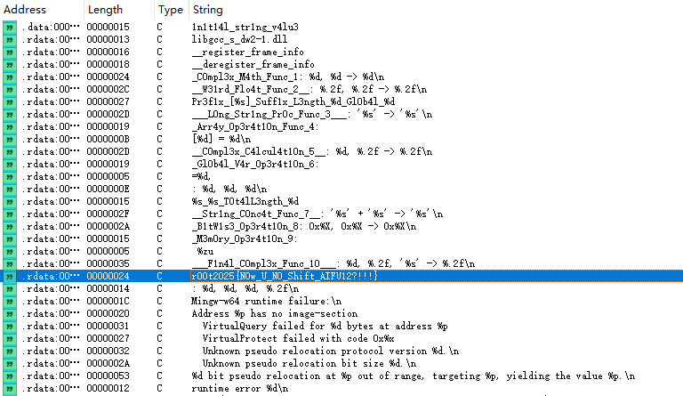

直接看到目标字符串flag。

当然还有一种做法是用linux的strings查找字符串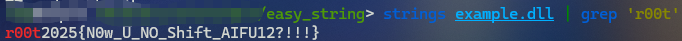

## 最简单的加密

### 出题思路

在字符串的基础上再加一层，考察在没有符号表的情况下如何找到函数主体，同时复习异或操作。

### 解题思路

字符串中发现测试运行时候的提示字符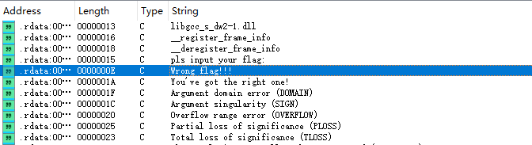

双击条目进入后点击对应变量按下 `ctrl+X`进入交叉引用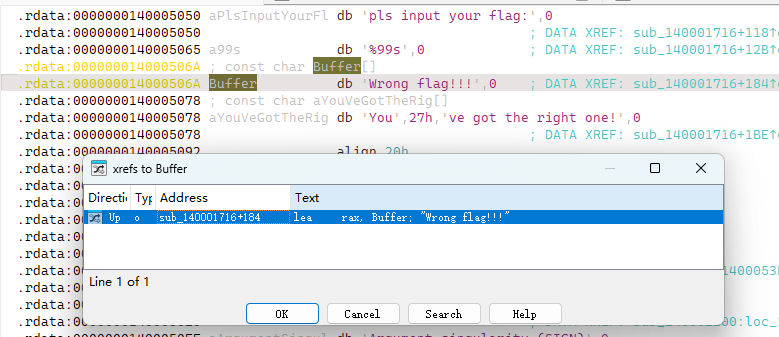

点击OK进入对应反汇编代码逻辑再按`F5`或者`Tab`转换成伪C代码。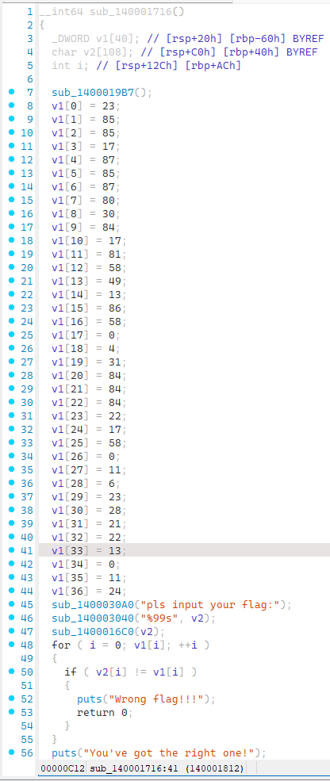

然后根据字符串判断功能，大体可以发现`sub_1400030A0`是输出函数，`sub_140003040`是输入函数，`sub_1400016C0`是加密函数，`v1`就是最后比较的内容。

逆向加密函数即可发现是每个字节异或0x65，再异或一次即可得到答案。

```
__int64 __fastcall sub_1400016C0(__int64 a1)
{
  __int64 result; // rax
  int i; // [rsp+Ch] [rbp-4h]

  for ( i = 0; ; ++i )
  {
    result = *(unsigned __int8 *)(i + a1);
    if ( !(_BYTE)result )
      break;
    *(_BYTE *)(i + a1) ^= 0x65u;
  }
  return result;
}
```

### 解题脚本

```python
v1 = [0]*38
v1[0] = 23
v1[1] = 85
v1[2] = 85
v1[3] = 17
v1[4] = 87
v1[5] = 85
v1[6] = 87
v1[7] = 80
v1[8] = 30
v1[9] = 8
v1[10] = 17
v1[11] = 81
v1[12] = 58
v1[13] = 49
v1[14] = 13
v1[15] = 86
v1[16] = 58
v1[17] = 0
v1[18] = 4
v1[19] = 31
v1[20] = 84
v1[21] = 84
v1[22] = 84
v1[23] = 22
v1[24] = 17
v1[25] = 58
v1[26] = 0
v1[27] = 11
v1[28] = 6
v1[29] = 23
v1[30] = 28
v1[31] = 21
v1[32] = 22
v1[33] = 13
v1[34] = 0
v1[35] = 11
v1[36] = 24

for i in range(37):
    v1[i]^=0x65
    print(chr(v1[i]),end='')
# r00t2025{1t4_Th3_eaz111st_encrypshen}
```

## 这是一朵花

### 出题思路

考察花指令的查找和文件修补技巧。

### 解题思路

1. 一样先定位字符串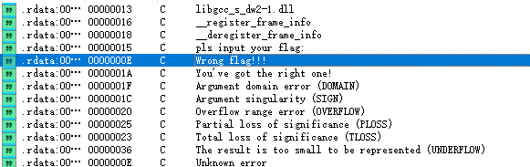
2. 但是在`ctrl+X`的时候发现很多字符串无交叉引用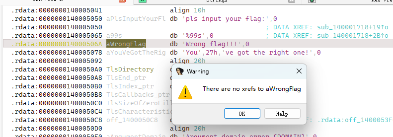
3. 其实这就是由于花指令导致的，我们找到可以交叉引用的字符串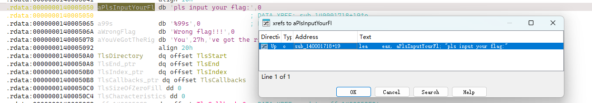
4. 发现伪C代码有`jumpout`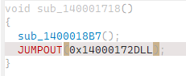
5. 普通代码有`endp ; sp-analysis failed`等问题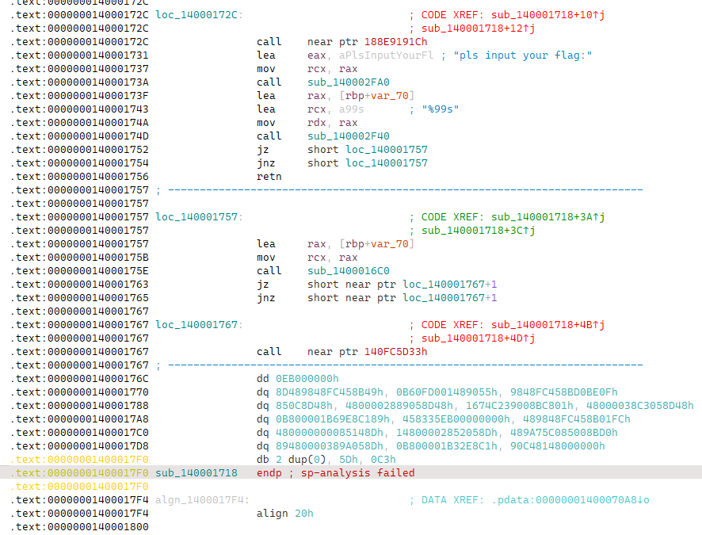
6. 其实这就是花指令引起的，仔细观察发现jz与jnz跳转到同一个地址，等同于`if(a){jmp};if(!a){jmp};`是一定会跳转的。于是可以修改此处代码变成`jmp short near ptr loc_140001767+1`，其他地方变成`nop`。又观察`loc_140001767`，该地址就在下面，`+1`就是多一个字节，于是可以把`jz`，`jnz`，`loc_140001767`的第一个字节都`patch`成`nop`。
7. 操作方法：
8. 为方便观察，先选择`Option`内的`General`选项，将`Number of opcode bytes`改成8（一般32位改成4就行）
9. 再点击想要改变的字节的行，选择`edit`的`patch program`中`Change bytes`选项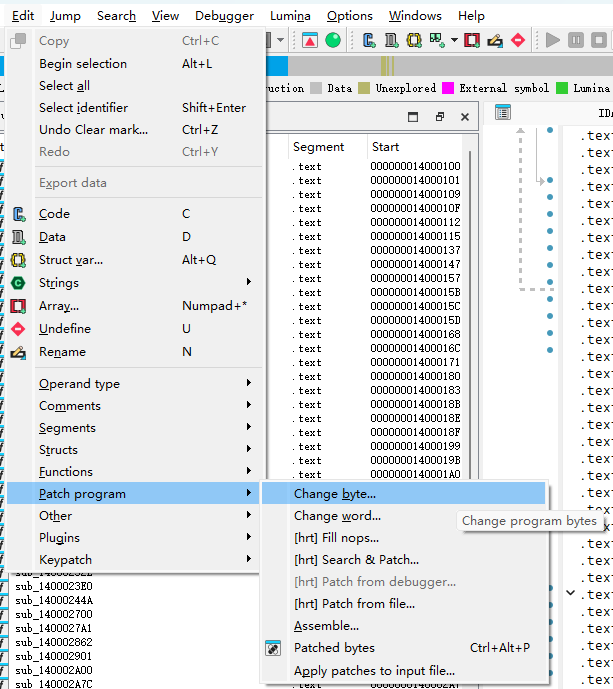
10. 比照对应的内容，将内容改成`nop`（90）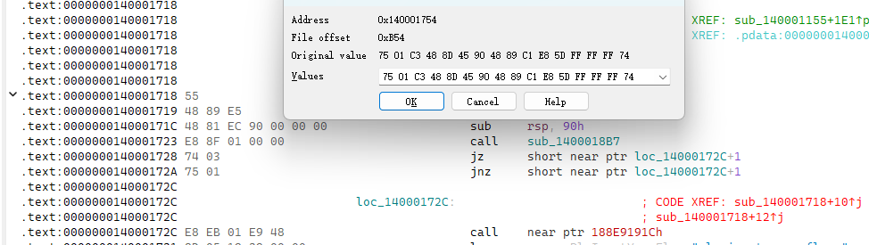
11. 该成90后，点击OK，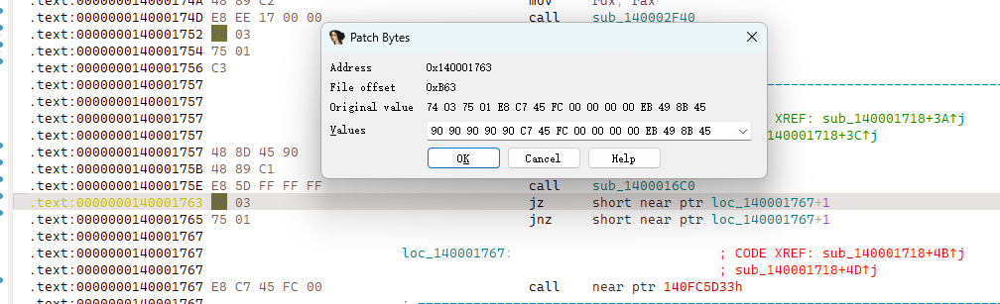
12. 系统正常情况会自动重新分析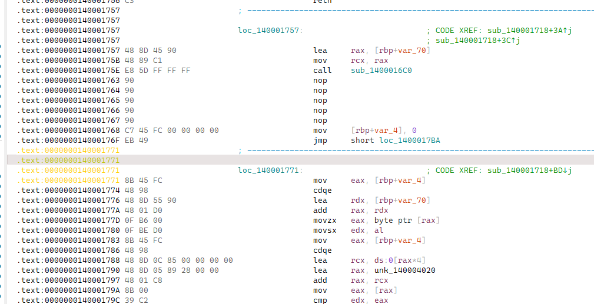
13. 如果没有重新分析则先按U进行undefine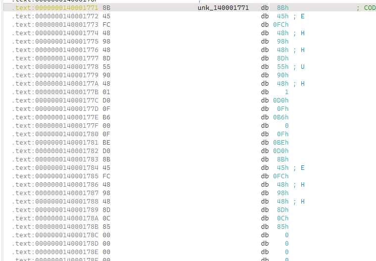
14. 再按P重新分析形成函数（如果是部分无法形成函数则从函数头开始按U再按P）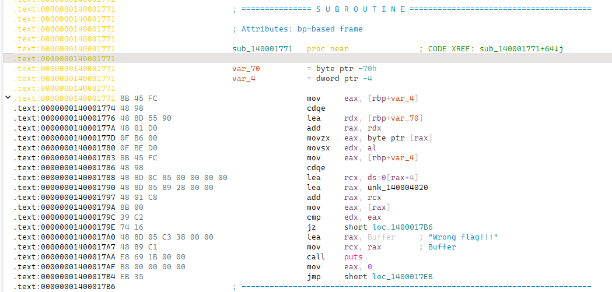
15. 也可以重新找到`patch prgramme`，选择`apply patches to input file`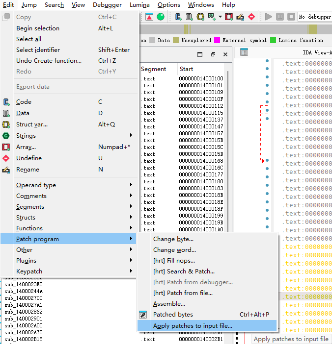
16. 直接点击OK，整个程序的patch字节就被保存了，关闭ida之后该字节也会保留更改。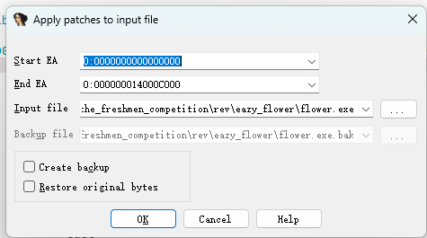
17. 因此可以关闭文件再打开，让ida自动重新分析。
18. 重复以上步骤直至所有花指令被修复，不再影响阅读程序为止。
19. 此时重新进入字符串界面，发现之前无法查找的字符串现在可以找到交叉引用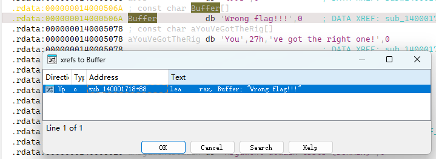
20. 进入程序主逻辑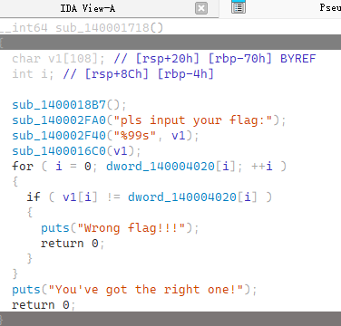
21. 发现`sub_1400016C0`是加密函数，加密方式是简单的凯撒；`dword_140004020`是比较数组，手抄下来或者找个组件dump下来（注意`2 dup(33h)`是什么意思）可以通过Undefine观察的更加清晰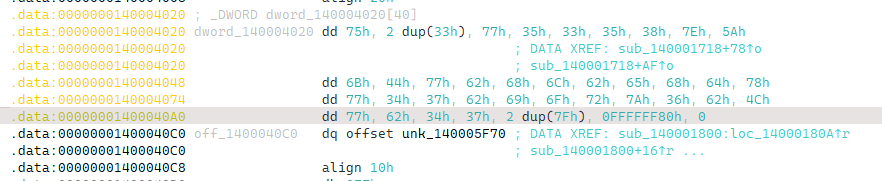

### 解题脚本

```python
flag = [117, 51, 51, 119, 53, 51, 53, 56, 126, 90, 107, 68, 119, 98, 104, 108, 98, 101, 104, 100, 120, 119, 52, 55, 98, 105, 111, 114, 122, 54, 98, 76, 119, 98, 52, 55, 127, 127, -128]

# IMPORTANT: 注意存在负数：-128，需要通过&0xFF模拟C语言中的char
for i in flag1:
    print(chr((i-3)&0xFF),end='')
# r00t2025{WhAt_ei_beaut14_flow3_It_14||}
```

## mine_clearance

### 出题思路

光玩这个游戏没法得到flag， <del>这是游戏特性</del>，其实是懒得改了——写这个内容给我累死了。

### 解题思路

这道题可以算作趣味向的入门rev。在把游戏中的每个按钮测试一下，在点击`Save&Exit`按钮后，会在当前目录下生成一个`minesweeper.dat`文件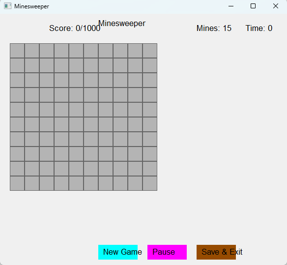

进入该文件发现如下内容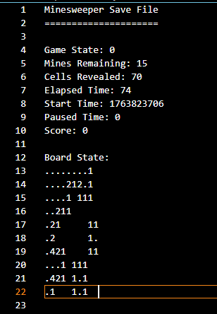

存在Score，如果完成一局会发现Score变成100。

于是尝试将Score更改为1000。

进入游戏发现弹窗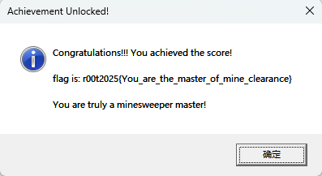

即为flag。

**本题还有小彩蛋哦，详见新生赛。**


## 火红

### 出题思路

gba是对的，打游戏就完事了，不想打游戏的有难了（怎么就没人打，多好玩啊🐶），要找到对应的汉化表或者汉化工具。

### 解题思路

上网搜索如何打开gba文件，发现可以使用`GBAVisualBoy`，下载一个，然后开始愉快玩耍（选项>输入>configure中可以选择键位映射，当然用手柄就更爽啦）

本题有两段对应的flag，均藏在新增的地图中，该地图在第一个特殊场馆旁边，新增的一家超市内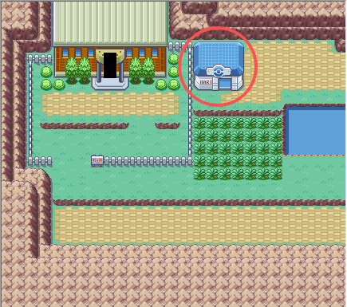

进入该超市，通过加速或者tas的方式通过两个快速行走的人，进入旁边的传送门

这样就进入了新的小镇，在出门的牌子上就是第一段flag

`恭喜你发现隐藏剧情！\n所有的flag都在这个小镇中。\pflag第一部分：\lEaz1_Ak34\n_2_z1\pNOTICE： \nSurfing--important！！！`

对于游玩的同学来说，这里不存在`\p \l \n`，这是三种不同的换行符。

提示Surfing--important，提示我们接下来要掌握冲浪技能。

我们回去按部就班的打怪升级，直到获得surfing技能，回来度过右边的水到小山坡上，那上面的一个人有着第二个flag部分

不过他需要我们拥有0x9999以上的金币用于换取。当我们赚到或者用CE修改得到正确的钱数后，会告诉我们flag：`你有足够的钱。\pflag2是：\l_p0kamown_is\n_!ntrezd1ng!`，一样去除换行符。

然后我们将两部分flag用r00t2025{}包起来，就得到最终flag了。

本来还有flag3和flag4想等大家新生赛做的，现在看看算了，太牢了😂。

两个其他flag的地点如下：3需要有极强的战斗力，成功战胜后可得到flag；4只要过去就送，和1相同。